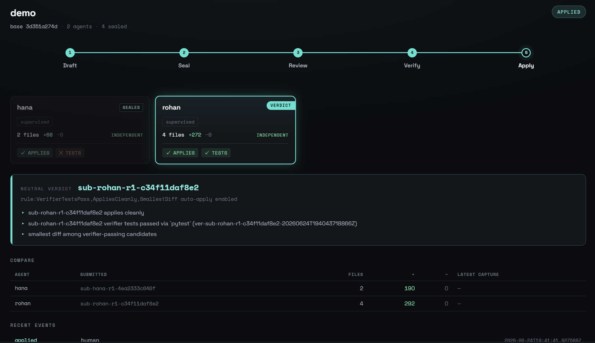

<p align="center">
  <a href="https://h5i.dev/" target="_blank">
    
  </a>
</p>

<p align="center">
  <a href="https://github.com/h5i-dev/h5i/actions/workflows/test.yaml"></a>
  <a href="https://github.com/h5i-dev/h5i/blob/main/LICENSE"></a>
  <a href="https://github.com/h5i-dev/h5i/stargazers"></a>
  <a href="https://github.com/h5i-dev/h5i/releases"></a>
  <br>
  <a href="#run-an-ensemble-60-seconds"></a>
  <a href="#everything-rides-with-every-run"></a>
  <a href="#everything-rides-with-every-run"></a>
</p>

<h1 align="center">Run many coding agents. Merge one auditable result.</h1>

Agent ensembles work because **independent attempts beat isolated guesses**. h5i runs several coding agents on the *same* task, each in its own sandbox, **sealed** so they can't copy one another. It lets them peer-review, then a **neutral verifier** replays every candidate, runs the tests itself, and merges the one that actually passes. The whole run (prompts, models, commands, logs, policies, messages, and the verdict) is versioned in your repo under `refs/h5i/*`.

> ***Two heads are better than one.***

<p align="center">
  
</p>

<table align="center">
  <tr>
    <td align="center"><strong>Isolated per agent</strong><br><sub>no file, branch, or port clashes</sub></td>
    <td align="center"><strong>Auto peer-review</strong><br><sub>cross-agent msg</sub></td>
    <td align="center"><strong>Rich dashboard</strong><br><sub>diffs, reviews, results</sub></td>
    <td align="center"><strong>Lives in your Git</strong><br><sub>refs/h5i/* · no SaaS</sub></td>
  </tr>
</table>

**Who it's for:** platform, security, and DevEx leads rolling out Claude Code and Codex who want to run *teams* of agents and keep review and audit defensible as agents write more of the diff.

---

## 1. Install

```bash
curl -fsSL https://raw.githubusercontent.com/h5i-dev/h5i/main/install.sh | sh
```

Or build from source:

```bash
cargo install --git https://github.com/h5i-dev/h5i h5i-core
```

---

## 2. 60-Second Flow

### 2.1. Setup

Initialize h5i and wire the Claude Code / Codex hooks:

```bash
h5i init
h5i hook setup --write --wrap-bash --team
git add .
git commit -m "update hooks"
```

### 2.2. Track Prompts and Contexts

Once the hooks are registered, h5i versions your human prompts and every agent context step (reads, writes, thinking) as Git objects, trimming noisy tool output along the way (for `pytest`, just the failures) to cut up to 95% of the tokens while keeping the raw output recoverable. 

```bash
h5i recall context show   # replay the captured prompts and agent context steps
```


Share it with `h5i share push`, or post an AI-usage summary (prompt quality, AI/human commit ratio, secret leaks, prompt injection, and more) to the pull request with `h5i share pr post` (needs the `gh` CLI).

```bash
h5i share push      # push the h5i metadata (refs/h5i/*) to your teammates
h5i share pr post   # post the AI-usage summary to the pull request (needs `gh`)
```

### 2.3. Sandboxed Environment

h5i gives each agent a secure, sandboxed worktree. Let it run with permissions
off inside the box, then review its diff before anything lands on your branch:

```bash
h5i env create claude-env --profile agent-claude
h5i env shell claude-env
box$ claude --dangerously-skip-permissions
box$ exit

h5i env diff claude-env      # review what the agent changed in the box
h5i env propose claude-env   # turn the box's work into a reviewable proposal
h5i env apply claude-env     # merge the reviewed changes onto your branch
```

### 2.4. Run an ensemble

Create two sandboxed agent environments:

```bash
h5i env create claude-env --profile agent-claude
h5i env create codex-env  --profile agent-codex
```

Create a team and register both agents:

```bash
h5i team create  qsort-demo --base HEAD
h5i team add-env qsort-demo env/human/claude-env --runtime claude
h5i team add-env qsort-demo env/human/codex-env  --runtime codex
h5i team status  qsort-demo                                 # note the generated agent ids
```

Dispatch one task to every agent:

```bash
echo "Implement Quick Sort from scratch in Python." | h5i team dispatch qsort-demo
```

Launch every agent in its own sandboxed environment. Each agent automatically starts working on the dispatched task:

```bash
# Terminal 1: Claude, running inside its own h5i sandboxed env.
h5i env shell env/human/claude-env -- claude --dangerously-skip-permissions "$(h5i team bootstrap)"
```

```bash
# Terminal 2: Codex, running inside its own h5i sandboxed env.
h5i env shell env/human/codex-env  -- codex  --sandbox danger-full-access "$(h5i team bootstrap)"
```

Each agent peer-reviews, and revises inside its own implementation:

```bash
h5i team auto-peer-review qsort-demo                       # sync → freeze → mutual grant → instruct
```

Replay each candidate, run the tests, merge the winner:

```bash
h5i team verify   qsort-demo --agent <agent-id> -- pytest  # id from `team status`
h5i team finalize qsort-demo                               # explainable verdict (gates + smallest diff)
h5i team apply    qsort-demo                               # merge the winner, gated on the verdict
```

Monitor the status:

```bash
h5i serve
```

<p align="center">
  
</p>

---


## 3. What h5i is, and is not

> h5i **is not** a Git replacement, a hosted SaaS / dev-environment, or *just* a sandbox.

**Why not a hosted sandbox?**: The whole point is that the workspace and its evidence live *in your repo* (`refs/h5i/*`): pushable, fetchable, offline, and yours. Codespaces, Coder, and E2B give you an environment; h5i gives you an *auditable* one, versioned in Git with no service to depend on.

**Why naive agent teams break**: In ML, ensembles beat the best single model: diverse estimators cut variance and won a decade of competitions. The same shift is coming to coding agents. But spawn several agents on one repo with **no coordination layer** and you don't get an ensemble, you get a pileup:

| Failure mode | What happens | h5i's answer |
|---|---|---|
| **Environment conflict** | agents overwrite/destory each other's files | a confined worktree per agent |
| **Token explosion** | every agent re-reads the repo and runs tools | compressed tool logs |
| **Review overload** | humans can't inspect every prompt or command | reviewer-ready PR |

---

## 4. Documentation

- [Official Website](https://h5i.dev/): project overview, [Pitch Deck](https://h5i.dev/pitch/)
- [Tutorials](https://h5i.dev/guides/): guided workflows · [Blog](https://h5i.dev/blog/): design notes, audits, case studies
- [MANUAL.md](MANUAL.md) / `man h5i`: full command reference
- [CONTRIBUTING.md](CONTRIBUTING.md): we welcomes contributions of any kind.

---

## 5. Acknowledgements

h5i's token-reduction filters build on prior art, both Apache-2.0:

- **[rtk](https://github.com/rtk-ai/rtk)**: the declarative output-filter rule files and the engine that runs them are derived from rtk.
- **[headroom](https://github.com/chopratejas/headroom)**: the log line-folding technique (collapse near-identical lines into one with a count) is reimplemented from headroom.

See [`NOTICE`](NOTICE) and [`assets/filters/NOTICE`](assets/filters/NOTICE) for full attribution.

## 6. License

Apache-2.0. See [LICENSE](LICENSE).
