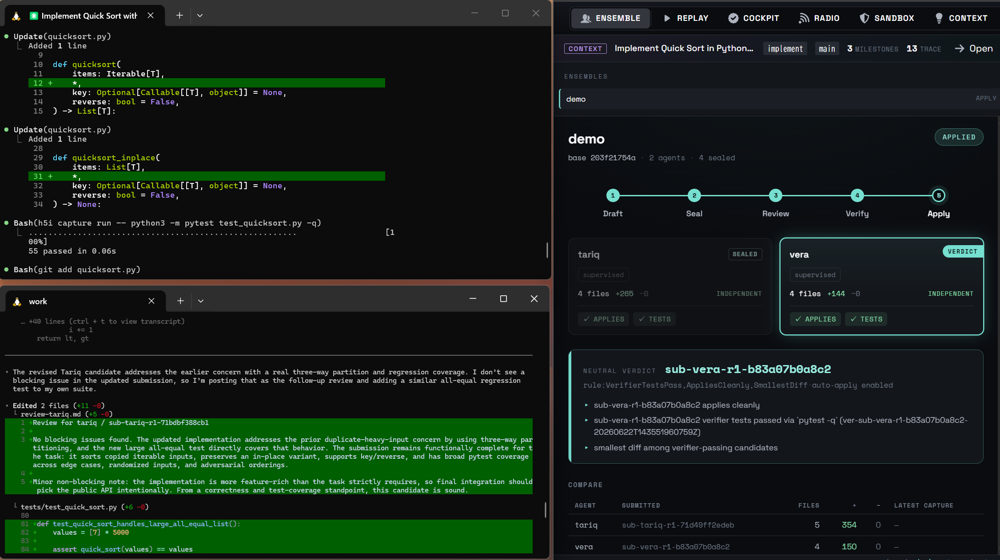

<p align="center">
  <a href="https://h5i.dev/" target="_blank">
    
  </a>
</p>

<p align="center">
  <a href="https://github.com/h5i-dev/h5i/actions/workflows/test.yaml"></a>
  <a href="https://github.com/h5i-dev/h5i/blob/main/LICENSE"></a>
  <a href="https://github.com/h5i-dev/h5i/stargazers"></a>
  <a href="https://github.com/h5i-dev/h5i/releases"></a>
  <br>
  <a href="#run-an-ensemble-60-seconds"></a>
  <a href="#everything-rides-with-every-run"></a>
  <a href="#everything-rides-with-every-run"></a>
</p>

<h1 align="center">Run many coding agents. Merge one auditable result.</h1>

Agent ensembles work because **independent attempts beat isolated guesses**. h5i runs several coding agents on the *same* task, each in its own sandbox, **sealed** so they can't copy one another. It lets them peer-review, then a **neutral verifier** replays every candidate, runs the tests itself, and merges the one that actually passes. The whole run (prompts, models, commands, logs, policies, messages, and the verdict) is versioned in your repo under `refs/h5i/*`.

> ***Two heads are better than one.***

<p align="center">
  
</p>

<table align="center">
  <tr>
    <td align="center"><strong>Isolated per agent</strong><br><sub>no file, branch, or port clashes</sub></td>
    <td align="center"><strong>Sealed attempts</strong><br><sub>independence-first</sub></td>
    <td align="center"><strong>Neutral verifier</strong><br><sub>a fair, sandboxed winner</sub></td>
    <td align="center"><strong>Lives in your Git</strong><br><sub>refs/h5i/* · no SaaS</sub></td>
  </tr>
</table>

**Who it's for:** platform, security, and DevEx leads rolling out Claude Code and Codex who want to run *teams* of agents and keep review and audit defensible as agents write more of the diff.

---

## Install

```bash
curl -fsSL https://raw.githubusercontent.com/h5i-dev/h5i/main/install.sh | sh
```

Or build from source:

```bash
cargo install --git https://github.com/h5i-dev/h5i h5i-core
```

---

## Run an ensemble (60 seconds)

Initialize h5i and wire the Claude Code / Codex hooks (the `--team` hook keeps each agent alive through the peer-review round):

```bash
h5i init
h5i hook setup --write --wrap-bash --team
```

Run the same task across several agents and merge the verified winner.

```bash
# 0. create sandboxed environments
h5i env create claude-env --profile agent-claude
h5i env create codex-env  --profile agent-codex

# 1. create a run, then add each env to the roster (each agent gets an
#    auto-generated id — `h5i team status` shows them)
h5i team create fix-auth --base HEAD
h5i team add-env fix-auth env/human/claude-env --runtime claude
h5i team add-env fix-auth env/human/codex-env  --runtime codex
h5i team status fix-auth                          # note the generated agent ids

# 2. launch every agent in its own sealed box (a terminal per env)
scripts/team-launch.sh fix-auth --task task.md

# 3. Each agent peer-reviews, and revises inside its box
scripts/team-review.sh fix-auth

# 3. the neutral verdict: replay each candidate, run the tests, merge the winner
# h5i team sync     fix-auth                       # ingest agents' staged work (no relaunch)
# h5i team freeze   fix-auth                       # seal the independent attempts
h5i team verify   fix-auth --agent <agent-id> -- cargo test   # id from `team status`
h5i team finalize fix-auth                       # explainable verdict (gates + smallest diff)
h5i team apply    fix-auth                       # merge the winner, gated on the verdict
```

Or drive the whole cycle hands-off:

```bash
scripts/team-run.sh fix-auth --task task.md --verify-cmd "cargo test" --apply
```

---


## What h5i is, and is not

- h5i **is not** a Git replacement, a hosted SaaS / dev-environment, or *just* a sandbox.
- h5i **is** a Git sidecar for **auditable agent ensembles**: run many agents, merge one provable result.

**Why not a hosted sandbox?**: The whole point is that the workspace and its evidence live *in your repo* (`refs/h5i/*`): pushable, fetchable, offline, and yours. Codespaces, Coder, and E2B give you an environment; h5i gives you an *auditable* one, versioned in Git with no service to depend on.

**Why naive agent teams break**: In ML, ensembles beat the best single model: diverse estimators cut variance and won a decade of competitions. The same shift is coming to coding agents. But spawn several agents on one repo with **no coordination layer** and you don't get an ensemble, you get a pileup:

| Failure mode | What happens | h5i's answer |
|---|---|---|
| **Environment conflict** | agents overwrite each other's files and may run destructive commands | a confined worktree + policy per agent (`h5i env`) |
| **Token explosion** | every agent re-reads the repo and drags raw logs into context | compressed tool logs (`h5i capture run`, ~95% less) |
| **Review overload** | humans can't inspect every prompt or command | reviewer-ready PR (`h5i share pr`) |

---

## Documentation

- [Official Website](https://h5i.dev/): project overview, [Pitch Deck](https://h5i.dev/pitch/)
- [Tutorials](https://h5i.dev/guides/): guided workflows · [Blog](https://h5i.dev/blog/): design notes, audits, case studies
- [MANUAL.md](MANUAL.md) / `man h5i`: full command reference

---

## Contributing

High-impact contributions:

- try h5i on a real AI-assisted repo and file issues with confusing moments
- run a real agent team and report where the cycle snags
- improve PR-body presentation and GitHub reviewer workflows
- add adapters for more test runners and agent tools
- harden prompt-injection and compliance rules

If the idea matters to you, starring the repo is the fastest way to help more AI-heavy teams find it.

---

## Acknowledgements

h5i's token-reduction filters build on prior art, both Apache-2.0:

- **[rtk](https://github.com/rtk-ai/rtk)**: the declarative output-filter rule files and the engine that runs them are derived from rtk.
- **[headroom](https://github.com/chopratejas/headroom)**: the log line-folding technique (collapse near-identical lines into one with a count) is reimplemented from headroom.

See [`NOTICE`](NOTICE) and [`assets/filters/NOTICE`](assets/filters/NOTICE) for full attribution.

## License

Apache-2.0. See [LICENSE](LICENSE).
