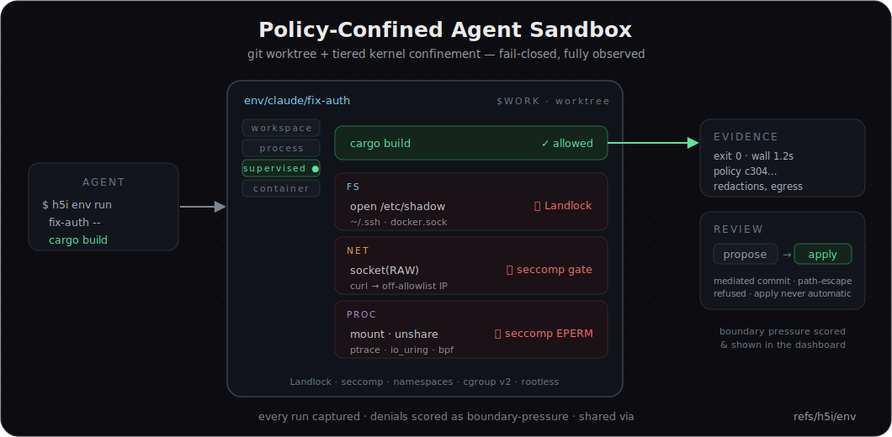

<p align="center">
  <a href="https://h5i.dev/" target="_blank">
    
  </a>
</p>

<p align="center">
  <a href="https://github.com/h5i-dev/h5i/actions/workflows/test.yaml"></a>
  <a href="https://github.com/h5i-dev/h5i/blob/main/LICENSE"></a>
  <a href="https://github.com/h5i-dev/h5i/stargazers"></a>
  <a href="https://github.com/h5i-dev/h5i/releases"></a>
  <br>
  <a href="#agent-radio"></a>
  <a href="#token-reduction"></a>
  <a href="#pull-request-briefs"></a>
</p>

Git records what changed. **`h5i`** records the rest: **who**, **why**, **what the agent knew**, **whether it was safe**, and **how the next agent picks up where the last left off**.

<table align="center">
  <tr>
    <td align="center">
      <strong>5</strong><br>
      <sub>Command groups</sub>
    </td>
    <td align="center">
      <strong>4 tiers</strong><br>
      <sub>Sandbox isolation</sub>
    </td>
    <td align="center">
      <strong>up to 95%</strong><br>
      <sub>Less token waste</sub>
    </td>
    <td align="center">
      <strong>3.5x</strong><br>
      <sub>Richer PR briefs</sub>
    </td>
    <td align="center">
      <strong>1.8x</strong><br>
      <sub>Multi-agent productivity</sub>
    </td>
  </tr>
</table>

Use `h5i` if you want your AI agents to stop leaving their work in thin air.

- Want to know which model, prompt, and reasoning led to a commit?
- Want the next agent to inherit the full context of the last one?
- Want Claude and Codex to talk in real time, with the conversation stored in Git?
- Want to reduce token usage by shrinking noisy tool output while keeping the raw evidence?
- Want to run a risky AI-generated code in a confined sandbox, then review it before it touches your tree?
- Want to catch leaked secrets, blind edits, and risky AI changes before review?

### Recent News

- **New in v0.1.7: Token Reduction with Unified Form.** Agents see a compact summary while the full output stays out of context, shared via Git LFS. [Jump to Token Reduction ↓](#43-token-reduction-with-unified-form)
- **Agent Radio reached 100+ points on Hacker News.** Read the discussion [here](https://news.ycombinator.com/item?id=48345837).
- **New in v0.1.5: Agent Radio.** Since your agents' context already lives in Git, they can now talk to each other through it. `h5i msg` adds a cross-agent message channel stored in `refs/h5i/msg`. [Jump to Agent Radio ↓](#41-agent-radio--agents-that-talk-over-git)

---

## 1. The foundation: a versioned record of every agent's work and communications

h5i is a pure Git sidecar for recording and sharing AI-agent contexts, metadata, and other useful information. It uses dedicated refs, so it doesn’t pollute your working tree or your normal branch graph.

| Ref | What lives there |
|---|---|
| `.git/refs/h5i/notes` | Per-commit metadata: model, agent, prompt, tests, decisions, risk signals. |
| `.git/refs/h5i/context` | The reasoning workspace as a DAG: goal, milestones, traces, branches. |
| `.git/refs/h5i/msg` | Cross-agent message log (append-only, union-merged on pull). |
| `.git/refs/h5i/objects` | Token-reduction capture manifests: command, exit code, and filtered summary of large outputs (full raw kept locally). |
| `.git/refs/h5i/env` | Sandbox environments: events, manifests, and digest-pinned policies for isolated, confined agent runs. |
| `.git/refs/h5i/checkpoints/<agent>` | Per-agent memory snapshots. |

Because these are Git objects, they are content-addressed, deduplicated, pushable, fetchable, and survive `git gc`.

<p align="center">
  
</p>

---

## 2. Install

```bash
curl -fsSL https://raw.githubusercontent.com/h5i-dev/h5i/main/install.sh | sh
```

Or build from source:

```bash
cargo install --git https://github.com/h5i-dev/h5i h5i-core
```

---

## 3. 60-Second Flow

Initialize h5i in an existing Git repo:

```bash
h5i init
```

For Claude Code hooks and MCP tools:

```bash
h5i hook setup
```

Post the PR review brief:

```bash
h5i share pr post --style review      # upsert sticky PR comment
h5i share pr body --style review      # render markdown for CI
```

`h5i share pr post` requires the GitHub CLI (`gh`) to be installed and authenticated
(`gh auth status` clean). Use `h5i share pr body` when CI should render markdown
without posting through `gh`.

Sync h5i sidecar refs with teammates:

```bash
h5i share push
h5i share pull
```

---

## 4. Feature Examples

### 4.1. Agent Radio — agents that talk over Git

Because that context already lives in Git, your agents can also **talk to each other through it**: `h5i msg` is a Git-backed cross-agent message channel stored in `refs/h5i/msg`, built for typed operational handoffs (`ASK` · `REVIEW_REQUEST` · `RISK` · `DONE` · `ACK`). Claude can ask, Codex can review, risks can be flagged and resolved, and the whole log survives clones, machines, and branches. It travels with `h5i share push` / `pull`, and divergent sends from two machines **union-merge with no messages lost**.

To efficiently use `h5i msg`, first register some hookups for agents: 

```bash
h5i msg setup
```

Then, we’re ready to let Claude and Codex communicate with each other in real time. Open two separate terminals, launch Claude Code and Codex, and give instructions to them.

**Example Instructions**

- Claude: `Can you play Chess with Codex via h5i`
- Codex: `Can you play Chess with Claude via h5i`

We can also monitor the conversation in real time with `h5i msg watch`. 

<p align="center">
  
</p>

### 4.2. Agent Sandbox — run risky work confined, captured, and reviewable

`h5i env` gives an agent an isolated **environment**: a git worktree plus a digest-pinned, **fail-closed** policy, so you can hand it a refactor, a dependency upgrade, or an untrusted build without it touching your main tree. Every `h5i env run` is policy-enforced and capture-wrapped — escape attempts (reading `/etc/shadow`, a raw socket to an arbitrary IP, `mount` / `unshare` / `ptrace`) are denied **at the boundary** by Landlock + seccomp + namespaces, while legitimate work proceeds and lands as tamper-evident evidence. Nothing reaches your branch until a reviewer approves a `propose` with `apply`.

Isolation is **tiered and never silently downgraded** — `h5i env probe` reports what the host can actually enforce, and a claim the host can't satisfy is refused, not weakened:

| Tier | Confinement |
|------|-------------|
| `workspace` | git worktree only — trusted code |
| `process` | Landlock + seccomp deny-list + user/net namespaces + cgroup v2 (rootless) |
| `supervised` | process tier + a live seccomp-notify socket gate (default-deny: only ordinary inet sockets pass) |
| `container` | rootless Podman + a DNS-pinned **`net.egress` domain allowlist** |

```bash
h5i env create fix-auth --isolation process
h5i env run    fix-auth -- cargo build       # confined + captured
h5i env propose fix-auth                     # mediated commit + review brief
h5i env apply   fix-auth                     # reviewer-selected; never automatic
```

Every run, allow or deny, is scored for **boundary pressure** and shown in the Sandbox tab of the [web dashboard](#46-web-dashboard); env state lives in `refs/h5i/env` and travels with `h5i push` / `pull` for a cross-clone review loop.

<p align="center">
  
</p>

### 4.3. Token Reduction with Unified Form

Wrap any command with `h5i capture run -- <cmd>` and the agent sees only a compact, normalized summary of errors, failures, and counts, while the full raw output is stored out of band in `refs/h5i/objects`. Every tool's output collapses into **one unified form**, so a 4 MB test log no longer burns your context window, and the raw bytes are always one `h5i recall object <id>` away when you need them.

```bash
# One Schema for Every Tool
tool: pytest
kind: test            # test | lint | typecheck | build | vcs | generic
status: failed        # passed | ok | failed | error | unknown
exit_code: 1
counts: { failed: 1, passed: 120 }
parser_confidence: parsed     # parsed | heuristic | generic
raw_oid: sha256:934f…         # the full output, always recoverable
findings:
  - kind: test_failure        # test_failure | diagnostic | build_error | panic | generic
    severity: failure
    id: tests/test_auth.py::test_refresh
    message: assert 0 == 100
    location: tests/test_auth.py:42
    fingerprint: 0bb827e4e61a  # stable across line shifts → dedupe / track
```

To share captures across a team, h5i borrows the split that Git LFS uses: the manifest in `refs/h5i/objects` is a lightweight pointer (it carries the raw output's `sha256`), while the bytes themselves ride on a native Git LFS backend, so huge tool output never bloats the Git object database. For remotes that are not HTTP, it transparently falls back to a git ref store.

<p align="center">
  
</p>

### 4.4. Context DAG

The context DAG shows how the work unfolded: the goal, every milestone, and the OBSERVE / THINK / ACT trace behind each change, captured automatically as the agent works. Because it is snapshotted on every commit, you can replay exactly what an agent knew and why it acted at any point in history.

```bash
h5i recall context show
```

<p align="center">
  
</p>

### 4.5. Pull Request Integration

When a branch is ready for review, h5i surfaces all of it where reviewers already work — on the pull request.


<table>
<tr>

<td width="38%" valign="top">

**The AI Pull Request Brief:**

```bash
h5i share pr post
```

---
**🔎 Review focus** 

The exact files to open first, ranked by where the agent spent its compute.

---
**🎯 Goal & Intent**

The goal agents were tasked to solve.

---
**📌 Reviewer checklist**

Actionable verification steps tailored for this specific diff.

---
**🧠 Reasoning**

The OBSERVE / THINK / ACT steps.

---
**🛡️ Security & Duplicated Code**

Automated check for credential leaks, blind edits, and copy-pasted blocks.

---
**🤖 AI Provenance**

Track the prompt, model names, and commit lineage.

<td width="62%" align="center">


</td>

</tr>
</table>

</br>

### 4.6. Web Dashboard

```bash
h5i serve        # http://localhost:7150
```

<p align="center">
  
</p>

---

## 5. Documentation

- [Official Website](https://h5i.dev/) - project overview
- [Tutorials](https://h5i.dev/guides/) - guided workflows
- [Blog](https://h5i.dev/blog/) - design notes, audits, and case studies

---

## 6. Contributing

High-impact contributions:

- try h5i on a real AI-assisted repo and file issues with confusing moments
- improve PR-body presentation and GitHub reviewer workflows
- add adapters for more test runners and agent tools
- harden prompt-injection and compliance rules
- improve dashboard workflows for reviewers

If the idea matters to you, starring the repo is the fastest way to help more AI-heavy teams find it.

---

## 7. Acknowledgements

h5i's token-reduction filters build on prior art, both Apache-2.0:

- **[rtk](https://github.com/rtk-ai/rtk)** — the declarative
  output-filter rule files and the engine that runs them are derived from rtk.
- **[headroom](https://github.com/chopratejas/headroom)** — the log line-folding
  technique (collapse near-identical lines into one with a count) is reimplemented
  from headroom.

See [`NOTICE`](NOTICE) and [`assets/filters/NOTICE`](assets/filters/NOTICE) for full attribution.

## 8. License

Apache-2.0. See [LICENSE](LICENSE).
