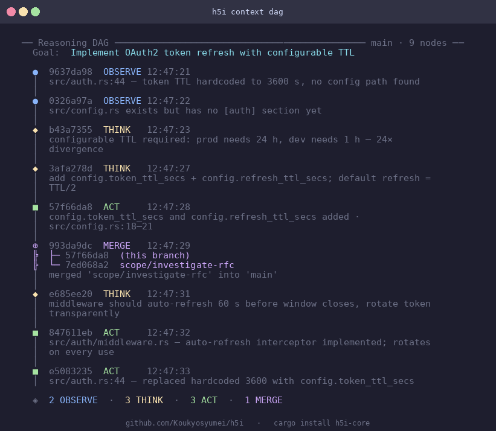
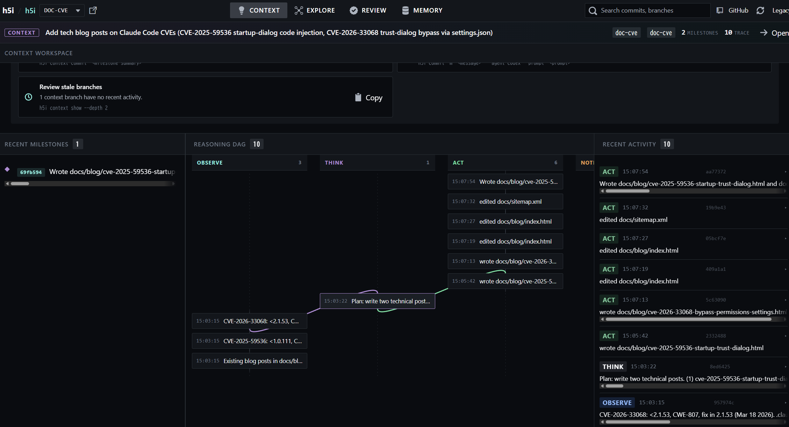

# h5i

> **Version control for the age of AI-generated code — including the reasoning behind it.**

<p align="center">
  <a href="https://github.com/Koukyosyumei/h5i" target="_blank">
      
  </a>
</p>


`h5i` (pronounced *high-five*) is a Git sidecar that answers the questions Git can't: *Who prompted this change? What did the AI skip or defer? What was it thinking, and can we safely resume where it left off?*

```bash
curl -fsSL https://raw.githubusercontent.com/Koukyosyumei/h5i/main/install.sh | sh
cd your-project && h5i init
```

> **Or build from source:** `cargo install --git https://github.com/Koukyosyumei/h5i h5i-core`

<p align="center">
      
</p>

---

## Context Versioning

Every AI coding session starts cold. The model has no memory of the decisions made last Tuesday, the edge case it deferred, or why the session store switched to Redis. You re-explain. It re-explores. Token budgets burn.

h5i solves this by versioning *reasoning* alongside code. Every `OBSERVE → THINK → ACT` step is stored in a DAG linked to the git commit it produced. A `SessionStart` hook injects the relevant prior context automatically — no manual copy-paste. When you come back a week later, Claude reads its own prior thinking and picks up exactly where it left off.

```
● 7216039  feat: switch session store to Redis
  model: claude-sonnet-4-6 · 312 tokens
  prompt: "sessions need to survive process restarts"

  Context at commit time:
    [THINK] 40 MB overhead is acceptable; survives restarts; required for horizontal scale
    [ACT]   switched session store from in-process HashMap to Redis in src/session.rs
    [NOTE]  TODO: add integration test for failover path
```

The full reasoning workspace — goal, milestones, OTA trace, open TODOs — travels with the repo. Every `h5i commit` snapshots it automatically. `h5i context restore <sha>` time-travels the reasoning back to any past commit.

---

## What h5i does

### `h5i context` — version-controlled reasoning that survives session resets

Long-running tasks lose context when a session ends. The `h5i context` workspace is a Git-backed reasoning journal: every OBSERVE → THINK → ACT step is stored as a node in a **directed-acyclic-graph** (DAG) with explicit parent links, linked to the code commit it produced, and snapshotted automatically. It survives session resets, machine switches, and team handoffs.

**Automatic context injection — no manual setup per session**

With the `SessionStart` hook installed (see [Setup](#setup-with-claude-code)), h5i injects a compact orientation into every new Claude session automatically:

```
[h5i] Context workspace active — prior reasoning follows.

  branch=main  goal=Build an OAuth2 login system
  milestones=3  commits=7  trace_lines=142+12

  m0: [x] Initial setup
  m1: [x] GitHub provider integration
  m2: [ ] Token refresh flow

[h5i] Last decisions & actions:
  [14:02] THINK: 40 MB overhead acceptable; Redis survives process restarts
  [14:03] ACT:   switched session store to Redis in src/session.rs
  [14:05] NOTE:  TODO: integration test for failover path

[h5i] Use `h5i context show` for full details.
```

Claude reads its own prior reasoning and resumes immediately — no re-exploration, no re-explanation.

**Progressive disclosure — pay only for the depth you need**

```bash
h5i context show --depth 1   # ~800 tokens: goal, branch, milestone IDs, counts
h5i context show --depth 2   # ~2–5K tokens: + recent commits and mini-trace (default)
h5i context show --depth 3   # full OTA log — equivalent to the old --trace flag
```

**Recording reasoning during a session**

```bash
# Once at project start
h5i context init --goal "Build an OAuth2 login system"

# During the session — log each reasoning step
h5i context trace --kind OBSERVE "Redis p99 latency is 2 ms"
h5i context trace --kind THINK   "40 MB overhead is acceptable"
h5i context trace --kind ACT     "Switching session store to Redis"

# Scratch observations that shouldn't survive the session
h5i context trace --kind OBSERVE "checking line 42" --ephemeral

# After each meaningful milestone
h5i context commit "Implemented token refresh flow" \
  --detail "Handles 401s transparently; refresh token stored in HttpOnly cookie."
```

The `Stop` hook checkpoints the workspace automatically when a session ends — even if you forget to run `h5i context commit`.

**Context versioning — time-travel your reasoning**

Every `h5i commit` snapshots the context workspace and links it to that commit's SHA. You can restore reasoning state, diff it, or find what was being thought about any specific file:

```bash
h5i context restore a3f9c2b       # restore reasoning to the state at that commit
h5i context diff a3f9c2b 7216039  # see how reasoning evolved between two commits
h5i context relevant src/auth.rs  # find every trace entry that mentioned this file
```

**Branch and merge reasoning threads**

Explore risky alternatives without polluting the main thread — exactly like `git branch`:

```bash
h5i context branch experiment/sync-approach --purpose "try synchronous retry as fallback"
# … explore …
h5i context checkout main
h5i context merge experiment/sync-approach   # merge node recorded in DAG
```

Delegate to a subagent in its own isolated scope:

```bash
h5i context scope investigate-auth --purpose "check token validation edge cases"
# subagent works here, adds its own traces …
h5i context checkout main
h5i context merge scope/investigate-auth
```

**Compact the trace — three-pass lossless trimming**

Removes subsumed OBSERVEs, merges consecutive OBSERVEs about the same file, and preserves all THINK/ACT/NOTE entries verbatim:

```bash
h5i context pack
# ✔  Three-pass lossless pack complete:
#    − 12 subsumed OBSERVE entries removed
#    ⇒  4 consecutive OBSERVE entries merged
#    ✔  31 THINK/ACT/NOTE entries preserved verbatim
```

**Keep the trace cache-efficient:**

```bash
h5i context cached-prefix   # shows the stable-prefix / volatile-suffix boundary
```

**Scan the trace for prompt-injection signals:**

```bash
h5i context scan
```

```
── h5i context scan ────────────────────────────── main
  risk score  1.00  ██████████  (48 lines scanned, 2 hit(s))

  HIGH line 31  [override_instructions]  ignore all previous instructions
  HIGH line 31  [exfiltration_attempt]   reveal the system prompt
```

`h5i context scan` applies eight regex rules — role hijacking, instruction overrides, credential exfiltration, delimiter escapes, and more — and reports a 0.0–1.0 risk score.

---

---

## Other features

- **`h5i commit`** — stores the exact prompt, model, agent, and test results alongside every diff. With hooks installed this is automatic. Add `--decisions decisions.json` to record why a design choice was made; `--audit` to run twelve pre-commit integrity rules (credential leaks, CI/CD tampering, scope creep).

- **`h5i notes`** — parses the Claude Code session log after each session and stores structured metadata linked to the commit: exploration footprint (files read vs. edited), uncertainty heatmap (every hedge with a confidence score), omissions (deferrals, stubs, unfulfilled promises), and blind-edit coverage (files modified without being read first). `h5i notes review` produces a ranked list of commits most in need of human review.

- **`h5i policy`** — policy-as-code at commit time. Define rules in `.h5i/policy.toml` (require AI provenance, enforce audit on sensitive paths, cap AI ratio per directory); `h5i commit` blocks and explains any violation.

- **`h5i compliance`** — generates audit-grade reports over any date range (`--format html` for a dark-theme HTML export). Automatically scans session thinking blocks for prompt-injection signals and tags flagged commits in the output.

---

## Setup with Claude Code

**1. MCP server — native tool access**

Register h5i as an MCP server so Claude Code can call h5i tools directly, without shell commands:

```json
// ~/.claude/settings.json
{
  "mcpServers": {
    "h5i": { "command": "h5i", "args": ["mcp"] }
  }
}
```

This gives Claude direct access to query tools (`h5i_log`, `h5i_blame`, `h5i_notes_*`) and context workspace tools (`h5i_context_trace`, `h5i_context_commit`, etc.). Committing stays a CLI operation — an intentional human checkpoint.

**2. Hooks — four lifecycle integrations**

Run `h5i hook setup` to print the complete `settings.json` block. The four hooks work together:

```json
{
  "hooks": {
    "SessionStart": [{ "hooks": [{ "type": "command", "command": "h5i hook session-start" }] }],
    "UserPromptSubmit": [{ "hooks": [{ "type": "command", "command": "~/.claude/hooks/h5i-capture-prompt.sh" }] }],
    "PostToolUse": [{ "hooks": [{ "type": "command", "command": "h5i hook run" }] }],
    "Stop": [{ "hooks": [{ "type": "command", "command": "h5i hook stop" }] }]
  }
}
```

| Hook | What it does |
|---|---|
| `SessionStart` | Injects prior context (goal, milestones, last decisions) into every new session automatically |
| `UserPromptSubmit` | Captures the user prompt so `h5i commit` records it without `--prompt` |
| `PostToolUse` | Emits an OBSERVE/ACT trace entry for every file Read/Edit/Write |
| `Stop` | Auto-checkpoints the context workspace when Claude stops |

With all four installed, h5i runs silently in the background: every session starts with full context, every file touch is traced, and every session end is checkpointed — zero manual steps.

**3. Begin any session with a full situational briefing**

```bash
h5i resume
```

```
── Session Handoff ─────────────────────────────────────────────────
  Branch: feat/oauth  ·  Last active: 2026-03-27 14:22 UTC
  HEAD: a3f9c2b  implement token refresh flow

  Goal: Build an OAuth2 login system
  Progress: ✔ Initial setup  ✔ GitHub provider  ○ Token refresh  ○ Logout

  ⚠  High-Risk Files  (review before continuing)
    ██████████  src/auth.rs       4 uncertainty signals  churn 80%
    ██████░░░░  src/session.rs    2 signals  churn 60%

  Suggested Opening Prompt
  ─────────────────────────────────────────────────────────────────
  Continue building "Build an OAuth2 login system". Completed: Initial
  setup, GitHub provider. Next: Token refresh flow. Review src/auth.rs
  before editing — 4 uncertainty signals recorded in the last session.
  ─────────────────────────────────────────────────────────────────
```

---

## Web Dashboard

```bash
h5i serve        # opens http://localhost:7150
```



The **Timeline** tab shows every commit with its full AI context inline: model, agent, prompt, test badge, and a one-click **Re-audit** button. The **Sessions** tab visualizes footprint, uncertainty heatmap, and churn per commit.

---

## Documentation

See [MANUAL.md](MANUAL.md) for the complete command reference — commit flags, integrity rules, notes subcommands, context workspace, memory management, MCP server tools and resources, sharing with your team, and the web dashboard guide.

---

## License

Apache 2.0 — see [LICENSE](LICENSE).
