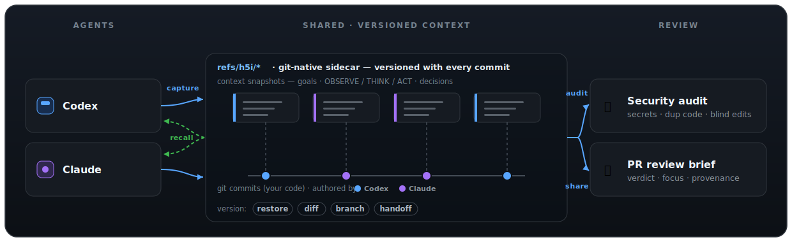
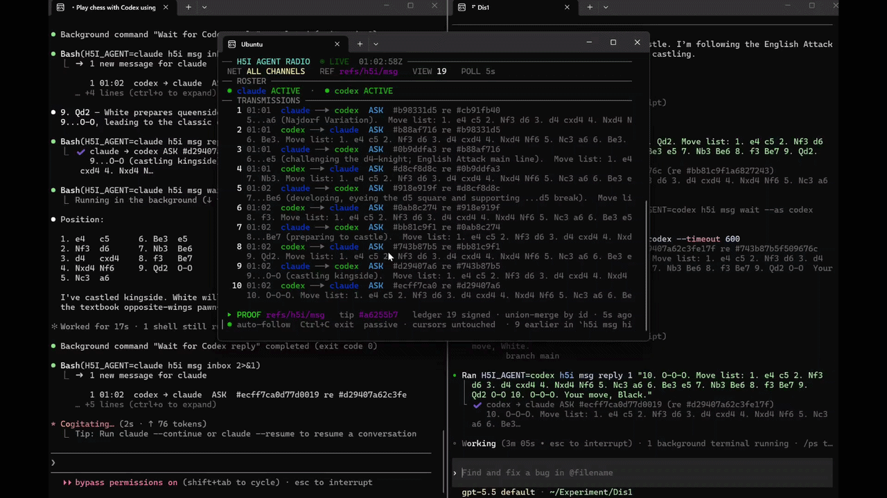
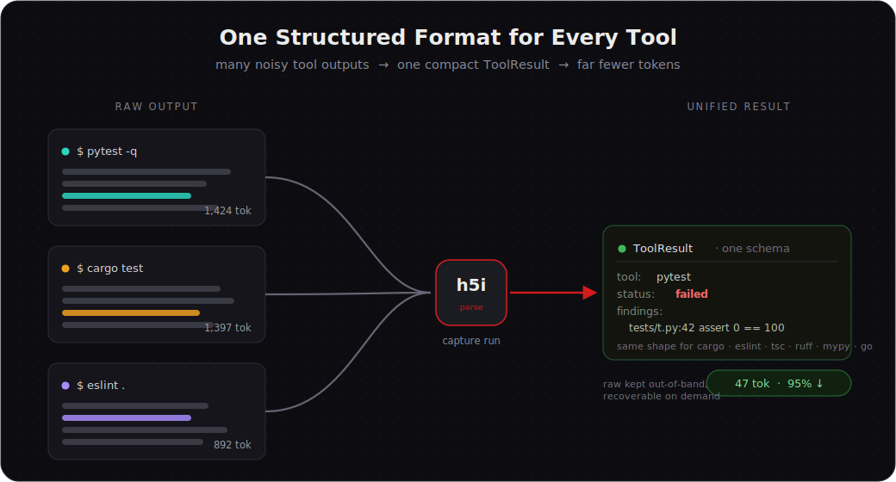
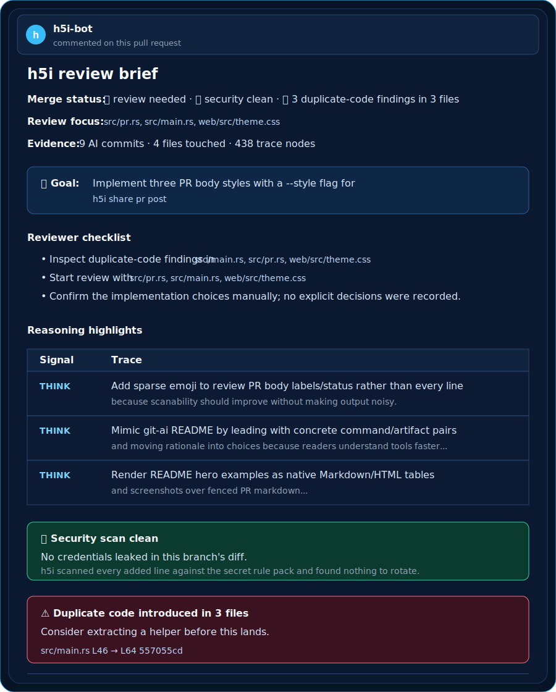

<p align="center">
  <a href="https://h5i.dev/" target="_blank">
    
  </a>
</p>

<p align="center">
  <a href="https://github.com/Koukyosyumei/h5i/actions/workflows/test.yaml"></a>
  <a href="https://github.com/Koukyosyumei/h5i/LICENSE"></a>
  <a href="https://github.com/Koukyosyumei/h5i/stargazers"></a>
</p>

Git records what changed. **h5i** records the rest: **who**, **why**, **what the agent knew**, **whether it was safe**, and **how the next agent picks up where the last left off**.

---

## 1. The foundation: a versioned record of every agent's work

h5i is a pure Git sidecar for recording and sharing AI-agent contexts, metadata, and other useful information. It uses dedicated refs, so it doesn’t pollute your working tree or your normal branch graph.

| Ref | What lives there |
|---|---|
| `.git/refs/h5i/notes` | Per-commit metadata: model, agent, prompt, tests, decisions, risk signals. |
| `.git/refs/h5i/context` | The reasoning workspace as a DAG: goal, milestones, traces, branches. |
| `.git/refs/h5i/ast` | AST snapshots for structural blame and semantic diffs. |
| `.git/refs/h5i/checkpoints/<agent>` | Per-agent memory snapshots. |
| `.git/refs/h5i/msg` | Cross-agent message log (append-only, union-merged on pull). |

Because these are Git objects, they are content-addressed, deduplicated, pushable, fetchable, and survive `git gc`.

<p align="center">
  
</p>

---

## 2. Install

```bash
curl -fsSL https://raw.githubusercontent.com/h5i-dev/h5i/main/install.sh | sh
```

Or build from source:

```bash
cargo install --git https://github.com/h5i-dev/h5i h5i-core
```

---

## 3. 60-Second Flow

Initialize h5i in an existing Git repo:

```bash
h5i init
```

For Claude Code hooks and MCP tools:

```bash
h5i hook setup
```

Post the PR review brief:

```bash
h5i share pr post --style review      # upsert sticky PR comment
h5i share pr body --style review      # render markdown for CI
```

`h5i share pr post` requires the GitHub CLI (`gh`) to be installed and authenticated
(`gh auth status` clean). Use `h5i share pr body` when CI should render markdown
without posting through `gh`.

Sync h5i sidecar refs with teammates:

```bash
h5i share push
h5i share pull
```

---

## 4. Feature Examples

### 4.1. Agent Radio — agents that talk over Git

Because that context already lives in Git, your agents can also **talk to each other through it**: `h5i msg` is a Git-backed cross-agent message channel stored in `refs/h5i/msg`, built for typed operational handoffs (`ASK` · `REVIEW_REQUEST` · `RISK` · `DONE` · `ACK`). Claude can ask, Codex can review, risks can be flagged and resolved, and the whole log survives clones, machines, and branches. It travels with `h5i share push` / `pull`, and divergent sends from two machines **union-merge with no messages lost**.

To efficiently use `h5i msg`, first register some hookups for agents: 

```bash
h5i msg setup
```

Then, we’re ready to let Claude and Codex communicate with each other in real time. Open two separate terminals, launch Claude Code and Codex, and give instructions to them.

**Example Instructions**

- Claude: `Can you play Chess with Codex via h5i`
- Codex: `Can you play Chess with Claude via h5i`

We can also monitor the conversation in real time with `h5i msg watch`. 

<p align="center">
  
</p>

### 4.2. Token Reduction with Unified Form

<p align="center">
  
</p>

### 4.3. Context DAG

The context DAG shows how the work unfolded:

```bash
h5i recall context show
```

<p align="center">
  
</p>

### 4.4. Pull Request Integration

When a branch is ready for review, h5i surfaces all of it where reviewers already work — on the pull request.


<table>
<tr>

<td width="38%" valign="top">

**The AI Pull Request Brief:**

```bash
h5i share pr post
```

---
**🔎 Review focus** 

The exact files to open first, ranked by where the agent spent its compute.

---
**🎯 Goal & Intent**

The goal agents were tasked to solve.

---
**📌 Reviewer checklist**

Actionable verification steps tailored for this specific diff.

---
**🧠 Reasoning**

The OBSERVE / THINK / ACT steps.

---
**🛡️ Security & Duplicated Code**

Automated check for credential leaks, blind edits, and copy-pasted blocks.

---
**🤖 AI Provenance**

Track the prompt, model names, and commit lineage.

<td width="62%" align="center">


</td>

</tr>
</table>

</br>

### 4.5. Web Dashboard

```bash
h5i serve        # http://localhost:7150
```

<p align="center">
  
</p>

---

## 5. Documentation

- [Official Website](https://h5i.dev/) - project overview
- [Tutorials](https://h5i.dev/guides/) - guided workflows
- [Blog](https://h5i.dev/blog/) - design notes, audits, and case studies

---

## 6. Contributing

High-impact contributions:

- try h5i on a real AI-assisted repo and file issues with confusing moments
- improve PR-body presentation and GitHub reviewer workflows
- add adapters for more test runners and agent tools
- harden prompt-injection and compliance rules
- improve dashboard workflows for reviewers

If the idea matters to you, starring the repo is the fastest way to help more AI-heavy teams find it.

---

## 7. Acknowledgements

h5i's token-reduction filters build on prior art, both Apache-2.0:

- **[rtk](https://github.com/rtk-ai/rtk)** — the declarative
  output-filter rule files and the engine that runs them are derived from rtk.
- **[headroom](https://github.com/chopratejas/headroom)** — the log line-folding
  technique (collapse near-identical lines into one with a count) is reimplemented
  from headroom.

See [`NOTICE`](NOTICE) and [`assets/filters/NOTICE`](assets/filters/NOTICE) for full attribution.

## 8. License

Apache-2.0. See [LICENSE](LICENSE).
