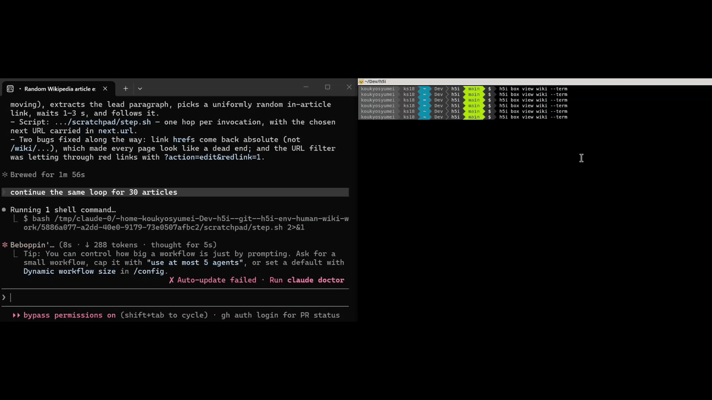

<p align="center">
  <a href="https://h5i.dev/" target="_blank">
    
  </a>
</p>

<p align="center">
  <a href="https://github.com/h5i-dev/h5i/actions/workflows/test.yaml"></a>
  <a href="https://github.com/h5i-dev/h5i/blob/main/LICENSE"></a>
  <a href="https://github.com/h5i-dev/h5i/stargazers"></a>
  <a href="https://github.com/h5i-dev/h5i/releases"></a>
</p>

<h1 align="center">A Secure, Auditable Browser for AI Agents</h1>

**h5i** (pronounced *high-five*) is a lightweight browser for policy-controlled, auditable agent access to the web. Every session records allowed and denied network requests in a reviewable receipt. Run it directly, sandbox only the browser, or contain the agent’s entire workflow in one disposable environment.


<table align="center">
  <tr>
    <td align="center">
      <strong>Pure Rust</strong><br>
      <sub>No Chromium or V8</sub>
    </td>
    <td align="center">
      <strong>~80% less peak memory</strong><br>
      <sub><a href="./crates/h5i-browser-light/DESIGN.md">In our benchmarks</a></sub>
    </td>
    <td align="center">
      <strong>Auditable networking</strong><br>
      <sub>Allowed and denied requests</sub>
    </td>
    <td align="center">
      <strong>Sandboxed by default</strong><br>
      <sub>One flag up to a box, one flag off</sub>
    </td>
  </tr>
</table>

**Pure Rust. No Chromium. No V8.**

```bash
h5i browser open https://example.com
h5i browser snapshot                    # the page as a model should read it
h5i browser click @e3
h5i browser requests                    # what it asked for, and what was refused
h5i browser audit                       # the whole session: verbs, fetches, handovers, ending
h5i browser close
```

<a href="https://trendshift.io/repositories/46160?utm_source=trendshift-badge&amp;utm_medium=badge&amp;utm_campaign=badge-trendshift-46160" target="_blank" rel="noopener noreferrer"></a>

<p align="center">
  
</p>

---

## 1. Install

```bash
curl -fsSL https://h5i.dev/install.sh | sh
# if you would rather not add a domain to the chain:
# curl -fsSL https://raw.githubusercontent.com/h5i-dev/h5i/main/install.sh | sh

# build from source
# cargo install --path .
```

The agent-facing interface is a skill, and the binary carries it:

```bash
h5i skill install                # writes it where your runtime looks
h5i skill show policy            # or just read a page
npx skills add h5i-dev/h5i       # if you do not have the binary yet
```

Two optional runtimes add stronger sandbox tiers: rootless
[Podman](https://podman.io/) provides `container`, while
[microsandbox](https://microsandbox.dev) (`msb`) provides `microvm` on a host
with hardware virtualization (`/dev/kvm` on Linux or Apple Silicon on macOS).

---

## 2. Use it

### 2.1. A browser session

A **session** is the whole agent-facing surface: one page state, one cookie jar,
one request log, one policy. `open` makes one and every verb that follows acts
on it; `close` ends it. Nothing else is a concept an agent has to learn.

```bash
h5i browser open https://docs.rs/ --allow docs.rs
h5i browser snapshot                        # outline, with @ref handles
h5i browser click    @e3
h5i browser type     @e5 "serde"
h5i browser extract  '{"titles": ["h2"]}'   # structured, by selector
h5i browser markdown                        # the page a reader would read
h5i browser close
```

No session id anywhere. `open` makes one and points the default at it, and
every verb that follows lands there. The opaque id (`br_7k2xqa`) exists, and it
is what `--json` and the receipts carry, because a durable reference has to
survive a rename. It is simply not what you type.

Running several at once is what names are for:

```bash
h5i browser open https://example.com/login --session auth --new
h5i browser open https://example.com/      --session public --new
h5i browser snapshot --session auth
```

Two verbs the shape of an agent loop makes worth having:

```bash
h5i browser snapshot --delta   # only what changed since the last read
h5i browser login              # hand the page to the human at the viewer
```

`--delta` matters because re-reading three hundred lines after every click is
the wrong shape for a loop. `login` closes the page to the agent while a person
types a credential into the live view. The session it establishes stays in the
jar afterwards, and the agent can see *that* it is logged in without ever
reading the cookie that says so.

#### Read the record

```bash
h5i browser requests           # every request, including the refusals
h5i browser audit              # the whole session: verbs, fetches, handovers, ending
h5i browser status             # placement, policy digest, who saw the network
h5i browser list               # every session on this machine, and which is default
```

### 2.2. Sandboxing, as a ladder

A session is **already sandboxed**. There is nothing to turn on, and the rungs
above and below it are one flag each.

| | what holds the engine | the request lane |
| --- | --- | --- |
| `--no-sandbox` | nothing | `engine-claimed` |
| **default** | a process-tier sandbox: its files and its environment | `engine-claimed` |
| `--in <box>` | a box whose tier enforces egress at its own boundary | `host-observed` |

#### The default

```bash
h5i browser open https://example.com
```

```
placed   : on this machine, in a process-tier sandbox (its files and its environment; not its network)
```

The same Landlock filesystem scoping, seccomp filter and rlimits that
`isolation = process` applies, built from a profile rather than a repository.
No box, no worktree, no manifest: putting a git operation in front of "read this
page" would be the wrong product.

It contains what a compromised engine could **do**. It may write only its own
session directory, reads nothing under `$HOME` except the font directories, and
starts with an empty environment, so secrets are named rather than inherited:

```bash
h5i browser open https://example.com --secret ACME_PASS
```

It does not contain what a compromised engine could **reach**. A browser needs
the network, so the host's reachability stays, loopback included; the policy
deciding *which* origins is the engine's own, and a compromised engine is past
it. It also does not forbid starting a program, and does not pretend to: what
makes that survivable is that Landlock's domain is inherited across `execve`,
so a shell the engine starts reads and writes exactly what the engine could.

**It does not upgrade the request lane.** A process-tier sandbox corroborates no
part of the log, so the session is still `engine-claimed`. Reading a sandbox as
evidence is the one mistake this product refuses.

Some hosts cannot confine at all: no Landlock, an AppArmor profile, a CI
container, macOS, Windows. There the session runs unconfined and **says which**,
on that line and in the record. A sandbox nobody can see is indistinguishable
from one that was never applied.

#### `--in <box>`: the rung that changes the claim

```bash
h5i box --profile browser --engine h5i --name web
h5i browser open https://example.com --in web
h5i browser snapshot                            # identical verb, identical answer
```

Nothing you type changes. What changes is **who saw the network**. The box
enforces its egress allowlist at its own boundary, outside the browser being
described, so the lane is upgraded from the engine's own account to an outside
observation:

```
requests : engine-claimed (fail-closed, and the engine's own account of what it fetched)
requests : host-observed  (also seen at the box's boundary, outside the engine)
```

Being inside a box is not by itself enough to earn the second line. A box that
lets the browser reach the whole network corroborates nothing, and h5i keeps
calling that session `engine-claimed`.

A boxed session also makes the human takeover real. Every verb is carried in
from the host, so pausing the agent is a boundary rather than a request.

```bash
h5i browser take       # a human takes control; the agent pauses
h5i browser release    # hands it back; the agent must re-snapshot first
h5i box view web       # watch the page, in a loopback-only forward
```

<p align="center">
  
</p>

### 2.3. A box holds more than a browser

The top rung of that ladder is a whole environment. It can hold the code, the
toolchain, the dev server and the agent itself, which is what you want when the
agent is building the app it is about to browse.

```bash
h5i box create alpha --profile agent-claude   # a sandboxed git worktree
h5i box shell alpha                           # an interactive confined session
h5i box run   alpha -- cargo test             # one command; the exit code passes through
h5i box propose alpha                         # freeze the work into a reviewable snapshot
h5i box apply   alpha                         # merge it onto the parent branch
h5i box export  alpha                         # patch, report and receipts you can read
h5i box rm      alpha                         # throw it away
```

```bash
h5i box share alpha --port 3000            # end-to-end encrypted P2P sharing
h5i box share alpha --port 3000 --tunnel   # or a browser-ready demo link
h5i join <ticket>                          # what the recipient runs
```

---

## 3. What confinement means here

`h5i box probe` reports the tiers your host can run. h5i never silently
downgrades: an unsatisfiable request fails closed.

A browser session uses `process` by default, without a box. The rows below it
are what `--in <box>` reaches for, and the difference that matters to a session
is the one thing `process` cannot do: enforce which addresses may be reached, at
a boundary outside the engine.

| Tier | What enforces it |
| --- | --- |
| `workspace` | a separate git worktree, no confinement |
| `process` | Landlock filesystem allowlist, seccomp deny-list, namespaces, rlimits |
| `supervised` | all of the above, plus a private network namespace with an **nftables egress allowlist pinned to resolved IPs**, DNS pinned by hosts file, and a seccomp-notify socket gate |
| `container` | rootless Podman, dropped capabilities, a portable image, and an HTTP/HTTPS proxy allowlist |
| `microvm` | a hardware-isolated guest with **its own kernel**, booted by [microsandbox](https://microsandbox.dev) (`msb`) from the same OCI images, with the egress allowlist evaluated **by the VM's network stack** |

microvm is the strongest tier and the only one that does not share the host
kernel. It requires msb, hardware virtualization (`/dev/kvm` or Apple Silicon),
and an image; otherwise it is refused, never downgraded.

Host credentials do not enter a box. A runtime-scoped proxy authenticates model
API requests outside the boundary, preventing cross-runtime access. Each box
receives a private, one-time copy of approved HOME state.

---

## 4. Documentation

- [Official Website](https://h5i.dev/): project overview, [Slides](https://h5i.dev/pitch/)
- [MANUAL.md](MANUAL.md) / `man h5i`: full command reference
- [CONTRIBUTING.md](CONTRIBUTING.md): we welcome contributions of any kind
- `h5i man > ~/.local/share/man/man1/h5i.1`: install the man page (generated from the CLI)

---

## 5. FAQ

<details>
<summary>Why not Playwright or Puppeteer?</summary>

They drive a browser. They do not tell you what it reached. h5i's engine is the
HTTP client, so the request log is a decision record it wrote before the bytes
moved, not a trace assembled beside the network. If a request is not in the log,
it did not happen.

</details>

<details>
<summary>Why do I not have to pass a session id?</summary>

Because you share a filesystem with the browser. An opaque id on every verb is
the shape of a remote-browser HTTP API, where the id exists because the client
and the browser have nothing else in common. Here `open` makes a session and
points the default at it, and the verbs that follow land there. The id still
exists in `--json` and in the receipts, where a durable reference belongs. Use
`--session <name>` when you want several at once.

</details>

<details>
<summary>Is a default session sandboxed?</summary>

Yes. `h5i browser open` runs the engine in a process-tier sandbox: Landlock
filesystem scoping, a seccomp filter and rlimits, with no box and no repository
involved. It contains what a compromised engine could *do* — its files, its
environment, its allocations.

It does not contain the network, because a browser needs one, and it does not
upgrade the request lane: a process-tier sandbox corroborates no part of the
log. `--in <box>` is the rung that does both. `--no-sandbox` turns it off, and
a host that cannot confine runs the session unconfined and says so.
`h5i browser status` prints which you have.

</details>

<details>
<summary>What do `engine-claimed` and `host-observed` mean?</summary>

`engine-claimed` is the browser's own account of what it fetched: fail-closed,
complete, and still the browser describing itself. `host-observed` means h5i
also saw it at a box's boundary, outside the browser. h5i never merges the two.

</details>

<details>
<summary>Does a box automatically make the lane host-observed?</summary>

No. A box whose policy lets the browser reach the whole network corroborates
nothing. The lane is upgraded only when something outside the engine decides
what may leave: an egress allowlist, or a net mode that denies everything.

</details>

<details>
<summary>Can h5i stop a page from injecting instructions into my agent?</summary>

Not by classifying the text, and it does not try. Page content arrives fenced as
data, escape sequences are stripped, and script is off unless you ask for it,
which removes the delivery channel entirely. What limits a persuaded agent is
the session's policy and the box, not a filter.

</details>

<details>
<summary>Can a human take the browser away from the agent mid-task?</summary>

Yes. `h5i browser take` pauses the agent's mutating verbs while read-only ones
keep working, and handing control back forces a re-snapshot because the page
moved. In a box that pause is enforced, because every verb is carried in from
the host. On this machine it is advisory, and `take` says so.

</details>

<details>
<summary>What happens if the browser crashes mid-task?</summary>

The session is recorded as `died`, with a time, and the next verb is refused
with exit code 69. Nothing restarts automatically. `--restore` carries the old
session's storage into a **new** session with a new id and the inheritance
written down; an id is never reused.

</details>

<details>
<summary>Can a box forge its identity on the forum?</summary>

Not on a confined tier. Forum storage stays outside the sandbox's grants, and
the host, not the payload, supplies the sender, role, box ID, and policy digest.

</details>

<details>
<summary>Does h5i guarantee that posts contain no secrets?</summary>

No. h5i scrubs supported patterns before writing Git objects, but this is
defense in depth, not a guarantee.

</details>

<details>
<summary>Which isolation tiers provide a security boundary?</summary>

`workspace` has no confinement and is refused unless explicitly allowed. Other
tiers enforce a boundary; only `microvm` has its own kernel.

</details>

<details>
<summary>Can h5i stop an agent from sending code to its model provider?</summary>

No. Model egress is a separate policy decision.

</details>

---

## 6. License

Apache-2.0. See [LICENSE](LICENSE).

---

## 7. Contributors

<a href="https://github.com/h5i-dev/h5i/graphs/contributors">
  
</a>
