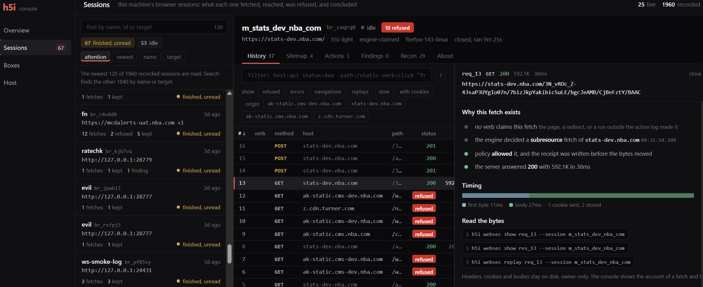

<p align="center">
  <a href="https://h5i.dev/" target="_blank">
    
  </a>
</p>

<p align="center">
  <a href="https://github.com/h5i-dev/h5i/actions/workflows/test.yaml"></a>
  <a href="https://github.com/h5i-dev/h5i/blob/main/LICENSE"></a>
  <a href="https://github.com/h5i-dev/h5i/stargazers"></a>
  <a href="https://github.com/h5i-dev/h5i/releases"></a>
</p>

<h1 align="center">A Secure, Auditable Browser for AI Agents</h1>

**h5i** (pronounced *high-five*) is a lightweight browser for policy-controlled, auditable agent access to the web. Every session records allowed and denied network requests in a reviewable receipt. Run it directly, sandbox only the browser, or contain the agent’s entire workflow in one disposable environment.


<table align="center">
  <tr>
    <td align="center">
      <strong>Pure Rust</strong><br>
      <sub>No Chromium or V8</sub>
    </td>
    <td align="center">
      <strong>~86% less peak memory</strong><br>
      <sub><a href="./docs/design/design-browser.md">In our benchmarks</a></sub>
    </td>
    <td align="center">
      <strong>~3× faster reads</strong><br>
      <sub><a href="./docs/design/design-browser.md">In our benchmarks</a></sub>
    </td>
    <td align="center">
      <strong>Sandboxed & auditable</strong><br>
      <sub>Browser-only or full workflow</sub>
    </td>
  </tr>
</table>

**Pure Rust. No Chromium. No V8.**

```bash
h5i browser open https://example.com
h5i browser snapshot                    # the page as a model should read it
h5i browser click @e3
h5i browser requests                    # what it asked for, and what was refused
h5i browser audit                       # the whole session: verbs, fetches, handovers, ending
h5i browser close

h5i browser read https://example.com          # or: one page, no session
```

<a href="https://trendshift.io/repositories/46160?utm_source=trendshift-badge&amp;utm_medium=badge&amp;utm_campaign=badge-trendshift-46160" target="_blank" rel="noopener noreferrer"></a>

---

## 1. Install

```bash
curl -fsSL https://h5i.dev/install.sh | sh
# curl -fsSL https://raw.githubusercontent.com/h5i-dev/h5i/main/install.sh | sh  # if you would rather not add a domain to the chain:
# cargo install --path .                                                         # build from source
```

The agent-facing interface is a skill, and the binary carries it:

```bash
npx skills add h5i-dev/h5i         # if you do not have the binary yet
# h5i skill install                # writes it where your runtime looks
# h5i skill show policy            # or just read a page
```

Two optional runtimes add stronger sandbox tiers: rootless
[Podman](https://podman.io/) provides `container`, while
[microsandbox](https://microsandbox.dev) (`msb`) provides `microvm` on a host
with hardware virtualization (`/dev/kvm` on Linux or Apple Silicon on macOS).

---

## 2. Use it

### 2.1. A headless browser

A **session** is the whole agent-facing surface: one page state, one cookie jar,
one request log, one policy:

```bash
h5i browser open https://docs.rs/ --allow docs.rs
h5i browser snapshot                        # outline, with @ref handles
h5i browser snapshot --delta                # only what changed since the last read
h5i browser click    @e3
h5i browser type     @e5 "serde"
h5i browser extract  '{"titles": ["h2"]}'   # structured, by selector
h5i browser markdown                        # the page a reader would read
h5i browser login                           # hand the page to the human at the viewer
h5i browser close
```

Running several at once is what names are for:

```bash
h5i browser open https://example.com/login --session auth --new
h5i browser open https://example.com/      --session public --new
h5i browser snapshot --session auth
```

Read what the page's media says:

```bash
h5i browser transcript --url https://example.com/talk --lang en                     # captions from <track>
h5i browser transcript --via yt-dlp --url https://www.youtube.com/watch?v=VIDEO_ID  # captions from YouTube and other sites
```

Choose a coherent browser identity for stealth-mode browsing:

```bash
h5i browser open https://example.com --identity privacy                      # h5i with its exact version hidden and time zone set to UTC
h5i browser open https://example.com --script --identity firefox-143-linux   # Firefox 143 on Linux
h5i browser open https://example.com --script --identity ./my-identity.toml  # custom identity from TOML
```

Read the record:

```bash
h5i browser requests           # every request, including the refusals
h5i browser audit              # the whole session: verbs, fetches, handovers, ending
h5i browser status             # placement, policy digest, who saw the network
h5i browser list               # every session on this machine, and which is default
```

Watch the browser it drives:

```bash
h5i box view <name>            # the box's page, through a loopback-only forward
h5i box view <name> --term     # draw it in this terminal instead (needs kitty)
```

<p align="center">
  
</p>


### 2.2. The configurable sandbox

While h5i runs in a light-weight sandbox by default, we can further specify
fine-grained setting in `.h5i/env.toml`.

```toml
[profile.reading]
isolation = "supervised"          # workspace | process | supervised | container | microvm

[profile.reading.net]
mode   = "host"
egress = ["docs.rs", "static.crates.io"]   # everything else is refused

[profile.reading.fs]
read  = ["/usr", "/etc"]          # replaces the defaults, so grant what it needs
write = []

[profile.reading.resources]
mem   = "512M"
procs = 64

secrets = ["ACME_PASS"]           # the only $H5I_SECRET_* it may substitute
```

Give it to a browser session through a box:

```bash
h5i box --profile reading --name docs
h5i browser open https://docs.rs/ --in docs
```

### 2.3. A sandbox holds more than a browser

The top rung of that ladder is a whole environment. It can hold the code, the
toolchain, the dev server and the agent itself, which is what you want when the
agent is building the app it is about to browse.

```bash
h5i box create alpha --profile agent-claude   # a sandboxed git worktree
h5i box shell alpha                           # an interactive confined session
h5i box run   alpha -- cargo test             # one command; the exit code passes through
h5i box propose alpha                         # freeze the work into a reviewable snapshot
h5i box apply   alpha                         # merge it onto the parent branch
h5i box export  alpha                         # patch, report and receipts you can read
h5i box rm      alpha                         # throw it away
```

```bash
h5i box share alpha --port 3000            # end-to-end encrypted P2P sharing
h5i box share alpha --port 3000 --tunnel   # or a browser-ready demo link
h5i join <ticket>                          # what the recipient runs
```

```bash
h5i ui # watch the whole fleet in a browser
```

<p align="center">
  
</p>

---

## 3. What confinement means here

`h5i box probe` reports the tiers your host can run. h5i never silently
downgrades: an unsatisfiable request fails closed.

| Tier | What enforces it |
| --- | --- |
| `workspace` | a separate git worktree, no confinement |
| `process` | Landlock filesystem allowlist, seccomp deny-list, namespaces, rlimits |
| `supervised` | all of the above, plus a private network namespace with an **nftables egress allowlist pinned to resolved IPs**, DNS pinned by hosts file, and a seccomp-notify socket gate |
| `container` | rootless Podman, dropped capabilities, a portable image, and an HTTP/HTTPS proxy allowlist |
| `microvm` | a hardware-isolated guest with **its own kernel**, booted by [microsandbox](https://microsandbox.dev) (`msb`) from the same OCI images, with the egress allowlist evaluated **by the VM's network stack** |

Host credentials do not enter a box. A runtime-scoped proxy authenticates model
API requests outside the boundary, preventing cross-runtime access. Each box
receives a private, one-time copy of approved HOME state.

---

## 4. Documentation

- [Official Website](https://h5i.dev/): project overview, [Slides](https://h5i.dev/pitch/)
- [MANUAL.md](MANUAL.md) / `man h5i`: full command reference
- [CONTRIBUTING.md](CONTRIBUTING.md): we welcome contributions of any kind
- `curl -fsSL https://h5i.dev/man/man1/h5i.1 -o ~/.local/share/man/man1/h5i.1`: install the man page

---

## 5. FAQ

<details>
<summary>What is h5i?</summary>

h5i is a fast, lightweight browser for AI agents, with built-in auditing and
configurable sandboxing. It runs locally and is open source.

</details>

<details>
<summary>Why use h5i instead of Playwright or Puppeteer?</summary>

Use Playwright or Puppeteer when maximum website compatibility is your
priority. Use h5i when you need lower resource use, network controls, a
complete session record, or a sandbox for both the browser and agent.

</details>

<details>
<summary>Does h5i work on every website?</summary>

No. h5i works best for content-heavy websites and common browser interactions,
but some browser APIs are not yet supported. For incompatible websites, you can
run Chromium inside an h5i sandbox.

</details>

<details>
<summary>Is h5i sandboxed by default?</summary>

The browser uses lightweight process isolation when available. For stronger
isolation, place the browser, or the agent's entire workflow, inside a
container or microVM.

</details>

<details>
<summary>Can h5i prevent prompt injection?</summary>

No browser can guarantee that. h5i limits the damage by treating page content
as untrusted and restricting what a misled agent can access through network
rules and sandboxing.

</details>

<details>
<summary>Can the agent see my passwords or cookies?</summary>

The agent can reference a named credential without reading its value, or a
human can take control to log in. The authenticated session continues without
returning the password or cookie to the model.

</details>

<details>
<summary>Does h5i keep my data local?</summary>

h5i has no hosted service and stores its sessions locally. Browser traffic
still goes to websites you allow, and model traffic goes to your configured
model provider.

</details>

---

## 6. License

Apache-2.0. See [LICENSE](LICENSE).

---

## 7. Contributors

<a href="https://github.com/h5i-dev/h5i/graphs/contributors">
  
</a>
