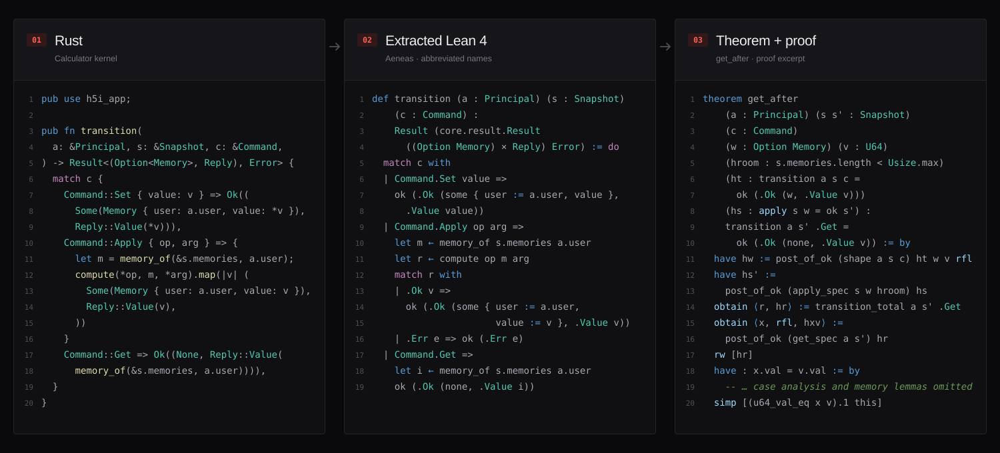

 <p align="center">
  <a href="https://h5i.dev/" target="_blank">
    
  </a>
</p>

<p align="center">
  <a href="https://github.com/h5i-dev/h5i/actions/workflows/test.yaml"></a>
  <a href="https://github.com/h5i-dev/h5i/blob/main/LICENSE"></a>
  <a href="https://github.com/h5i-dev/h5i/stargazers"></a>
  <a href="https://github.com/h5i-dev/h5i/releases"></a>
</p>

<h1 align="center">The Agent-Native Web Security Workspace</h1>

**h5i** (pronounced *high-five*) is a workspace for securing web applications through two complementary approaches: **finding vulnerabilities** with AI agents and **proving correctness** with formal verification.

- **Find Bugs (Red-Teaming):** Give AI agents a unified toolkit for browser automation, HTTP traffic manipulation, and reconnaissance. Test existing web applications for vulnerabilities, reproduce attacks, and run security regression checks in CI/CD.
- **Prove Correctness (Formal Verification):** Build applications with `h5i-app`, an Axum-based Rust framework designed for verification with Lean 4. Prove authorization, data isolation, and business logic properties directly against your Rust implementation.

**Build with agents. Red-team for bugs. Formally verify properties.**

```bash
# Find bugs in web applications
h5i browser open https://example.com                    # Open a website in the browser
h5i browser click @e3                                   # Interact with page elements
h5i websec requests                                     # Inspect captured HTTP traffic
h5i websec replay req_42 --set query.id=456             # Modify and replay a request
h5i recon crawl --max-requests 200                      # Crawl the application for attack surfaces

# Prove correctness of Rust application logic
h5i app new counter && cd counter                       # Create an h5i-app project
h5i app extract                                         # Translate Rust logic into Lean 4
h5i app prove                                           # Build and check formal proofs
h5i app mutate                                          # Test proof sensitivity with mutations
```

<a href="https://trendshift.io/repositories/46160?utm_source=trendshift-badge&amp;utm_medium=badge&amp;utm_campaign=badge-trendshift-46160" target="_blank" rel="noopener noreferrer"></a> 

---

## 1. Install

```bash
curl -fsSL https://h5i.dev/install.sh | sh -s -- --websec --recon --test         # `websec`, `recon`, and `test` are optional plugins
# curl -fsSL https://raw.githubusercontent.com/h5i-dev/h5i/main/install.sh | sh  # if you would rather not add a domain to the chain:
# cargo install --path .                                                         # build from source
# h5i plugin list                                                                # says what is installed
```

The agent-facing interface is a skill, and the binary carries it:

```bash
npx skills add h5i-dev/h5i         # if you do not have the binary yet
# h5i skill install                # writes it where your runtime looks
```

---

## 2. Find Bugs: Red-Team with Agents

Let AI agents explore, attack, and test web applications using h5i's integrated security toolkit. 

> **h5i works with any web services regardless of their framework**, and no migration to `h5i-app` is required.

- **Browser automation:** Navigate applications, interact with forms, and test authenticated workflows.
- **HTTP security testing:** Capture, modify, replay, and compare HTTP requests to investigate vulnerabilities.
- **Recon:** Discover endpoints, parameters, and hidden attack surfaces through crawling and JavaScript analysis.
- **Reproducible testing:** Save confirmed attack flows and replay them in CI/CD to catch security regressions.
- **Sandboxed workflow**: Run agents in isolated environments with configurable filesystem and network restrictions.

Agents access these capabilities through a unified CLI. You can also monitor their activity through the dashboard:

```bash
h5i ui    # Open the local dashboard
```

<p align="center">
  
</p>

See the [CLI manual](docs/MANUAL.md) for complete documentation and the [CI regression example](examples/security-regression-ci) for automated security testing.

---

## 3. Prove Correctness: Build on h5i-app

`h5i-app` is an Axum-based Rust web framework that makes application logic amenable to Lean 4.

> Red-teaming discovers bugs through testing. Formal verification takes a complementary approach: proving that specified properties hold for all possible inputs and behaviors.

```toml
[dependencies]
h5i-app = { version = "0.1.1", features = ["http", "postgres"] }
```

We can write web applications in Rust, translate them into Lean 4 via [Aeneas](https://github.com/AeneasVerif/aeneas), and prove various properties like authorization, 
isolation, business logics, and more.

<p align="center">
  
</p>

See the [h5i-app documentation](crates/h5i-app/README.md) for a complete example, the Axum integration, and the formal verification workflow.

---

## 4. Documentation

- [Official Website](https://h5i.dev/): project overview, [Slides](https://h5i.dev/pitch/)
- [MANUAL.md](docs/MANUAL.md) / `man h5i`: full command reference
- [CONTRIBUTING.md](CONTRIBUTING.md): we welcome contributions of any kind
- `curl -fsSL https://h5i.dev/man/man1/h5i.1 -o ~/.local/share/man/man1/h5i.1`: install the man page

---

## 5. License

h5i is licensed under the Apache License 2.0. See [LICENSE](LICENSE).

---

## 6. Contributors

<a href="https://github.com/h5i-dev/h5i/graphs/contributors">
  
</a>
