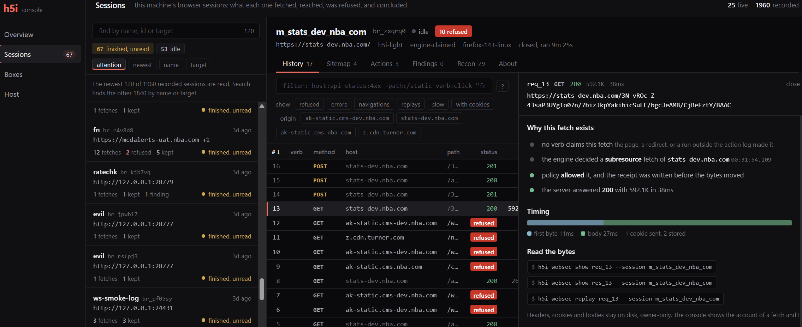

<p align="center">
  <a href="https://h5i.dev/" target="_blank">
    
  </a>
</p>

<p align="center">
  <a href="https://github.com/h5i-dev/h5i/actions/workflows/test.yaml"></a>
  <a href="https://github.com/h5i-dev/h5i/blob/main/LICENSE"></a>
  <a href="https://github.com/h5i-dev/h5i/stargazers"></a>
  <a href="https://github.com/h5i-dev/h5i/releases"></a>
</p>

<h1 align="center">Agent-native Workspace for Attack & Verify Web Security</h1>

**h5i** (pronounced *high-five*) is an agent-native workspace for both **offensive and verifiable web security**.

**Attack**: *Professional red-teaming with AI agent.* Give your agent browser automation and HTTP traffic control to explore applications, inspect requests, and investigate bugs. Perfect for bug bounty, penetration testing, and security regression test in CI. Configurable sandboxing and network policies keep agent activity within the boundaries you set.

**Defense**: *Application logic you can formally verify.* Build on [h5i-app](#4-build-verifiable-apps-h5i-app), h5i’s Axum-based Rust framework, and prove properties of your application logic in Lean 4, from authorization and tenant isolation to business rules and state invariants.

**Use either side independently, or combine them to build and secure your web app.**

<table align="center">
  <tr>
    <td align="center">
      <strong>Red-teaming</strong><br>
      <sub>Browser + direct HTTP control</sub>
    </td>
    <td align="center">
      <strong>Formal verification</strong><br>
      <sub><a href="#4-build-verifiable-apps-h5i-app">Rust + Lean 4</a></sub>
    </td>
    <td align="center">
      <strong>CI/CD</strong><br>
      <sub>Repeat security checks on every change</sub>
    </td>
    <td align="center">
      <strong>Sandboxed workflows</strong><br>
      <sub>Configurable limits + auditable sessions</sub>
    </td>
  </tr>
</table>

**Build with agents. Red-team for bugs. Formally verify properties.**

<a href="https://trendshift.io/repositories/46160?utm_source=trendshift-badge&amp;utm_medium=badge&amp;utm_campaign=badge-trendshift-46160" target="_blank" rel="noopener noreferrer"></a>

---

## 1. Install

```bash
curl -fsSL https://h5i.dev/install.sh | sh -s -- --websec
# curl -fsSL https://raw.githubusercontent.com/h5i-dev/h5i/main/install.sh | sh  # if you would rather not add a domain to the chain:
# cargo install --path .                                                         # build from source
```

The agent-facing interface is a skill, and the binary carries it:

```bash
npx skills add h5i-dev/h5i         # if you do not have the binary yet
# h5i skill install                # writes it where your runtime looks
# h5i skill show policy            # or just read a page
```

The optional `websec`, `recon` and `test` plugins ship as their own archives. The
installer can fetch and register them in the same pass:

```bash
curl -fsSL https://h5i.dev/install.sh | sh -s -- --websec --recon --test
# h5i plugin list                  # says what is installed
```

---

## 2. Use it

### 2.1. Browse, scrape, and automate

A **session** combines one page state, cookie jar, network policy, and request
record. Agents can read pages, interact with elements, and extract structured
data through one CLI:

```bash
h5i browser open https://docs.rs/ --allow docs.rs
h5i browser snapshot                        # page outline with @ref handles
h5i browser snapshot --delta                # only what changed
h5i browser click @e3
h5i browser type @e5 "serde"
h5i browser extract '{"titles": ["h2"]}'    # structured extraction
h5i browser markdown                        # readable page content
h5i browser close

h5i browser read https://docs.rs/           # for a single page without a persistent session
```

### 2.2. Test web applications

The native browser owns its network layer, so agents can capture, inspect, edit,
replay, and compare HTTP traffic without a separate repeater. On Linux and
macOS, sites that need full Chromium can use the same workbench through h5i's
agent-browser capture proxy.

Use these capabilities only on systems you own or are authorized to test:

```bash
h5i browser open https://target.example --capture --allow target.example
# Or: h5i browser proxy https://target.example --session chrome
# Then run the printed agent-browser command.
# Linux trusts the session CA. macOS passes --ignore-https-errors.

h5i websec requests                                  # list messages and IDs
h5i websec show req_42 --raw                         # inspect a request
h5i websec replay req_42 --set query.id=456          # edit and resend it
h5i websec diff res_42 res_43                        # compare responses
h5i websec match res_43 --status 200 --contains "ok" # assert a condition
h5i websec sequence flow.json                        # run a multi-step test

# Discovery, kept apart from testing: recon says what exists and how it knows.
h5i recon extract                                    # read what the session already fetched
h5i recon crawl --max-requests 200 --rate 4          # walk it under this session's login
h5i recon triage --calibrate                         # soft 404s folded, the rest confirmed
h5i recon endpoints --state confirmed --json         # each row names the message that proves it
```

### 2.3. CI/CD integration

Confirmed attack flows can be kept in a repository and replayed in CI. Templates and examples 
of GitHub Actions are available at [`examples/security-regression-ci`](examples/security-regression-ci).

```yaml
- uses: h5i-dev/h5i@v1
  with:
    target: http://localhost:3000
    tests: .h5i-tests/tests
    openapi: openapi.yaml
    # min-coverage is optional; omitting it keeps coverage informational.
```

### 2.4. Control and audit agent access

Web content is untrusted input to an AI agent. h5i reduces the risks of giving
agents web access by applying a network policy and recording both allowed and
denied requests:

```bash
h5i browser requests    # allowed and denied network requests
h5i browser audit       # actions, fetches, handovers, and session ending
h5i browser status      # isolation, policy digest, and network placement
```

For authenticated Chromium testing, use `agent-browser dashboard start`. The
human signs in directly in Chromium while `h5i websec` and `h5i recon` consume
the captured traffic through the same session interface.

For stronger isolation, define network and filesystem limits in
`.h5i/env.toml`:

```toml
[profile.reading]
isolation = "supervised"          # workspace | process | supervised | container | microvm

[profile.reading.net]
mode = "host"
egress = ["docs.rs", "static.crates.io"]

[profile.reading.fs]
read = ["/usr", "/etc"]
write = []
```

Then place the browser inside that environment:

```bash
h5i box --profile reading --name docs
h5i browser open https://docs.rs/ --in docs
```

### 2.5. Contain the entire agent workflow

A sandbox can contain more than the browser. It can also hold the workspace,
toolchain, development server, and agent itself. This is useful when an agent is
building and testing an application in the same environment.

```bash
h5i box create alpha --profile agent-claude   # sandboxed git worktree
h5i box shell alpha                           # interactive confined session
h5i box run alpha -- cargo test               # run a command inside it
h5i box propose alpha                         # create a reviewable snapshot
h5i box apply alpha                           # merge approved changes
h5i box export alpha                          # export the patch and receipts
h5i box rm alpha                              # discard the environment
```

Watch the workflow from the host:

```bash
h5i ui
```

<p align="center">
  
</p>

### 2.6. More browser capabilities

Name sessions to run several browsers independently:

```bash
h5i browser open https://example.com/login --session auth --new
h5i browser open https://example.com/ --session public --new
h5i browser snapshot --session auth
```

Read media transcripts, or choose a coherent browser identity:

```bash
h5i browser transcript --url https://example.com/talk --lang en
h5i browser transcript --via yt-dlp --url https://www.youtube.com/watch?v=VIDEO_ID

h5i browser open https://example.com --identity privacy
h5i browser open https://example.com --script --identity firefox-143-linux
```

---

## 3. Sandbox and isolation levels

h5i provides four sandbox levels, plus an unconstrained workspace mode.
Run `h5i box probe` to see which levels your host supports. h5i never silently downgrades: an unsatisfiable request fails closed.

| Tier | What enforces it |
| --- | --- |
| `workspace` | a separate git worktree, no confinement |
| `process` | Landlock filesystem allowlist, seccomp deny-list, namespaces, rlimits |
| `supervised` | all of the above, plus a private network namespace with an **nftables egress allowlist pinned to resolved IPs**, DNS pinned by hosts file, and a seccomp-notify socket gate |
| `container` | rootless Podman, dropped capabilities, a portable image, and an HTTP/HTTPS proxy allowlist |
| `microvm` | a hardware-isolated guest with **its own kernel**, booted by [microsandbox](https://microsandbox.dev) (`msb`) from the same OCI images, with the egress allowlist evaluated **by the VM's network stack** |

Host credentials do not enter a box. A runtime-scoped proxy authenticates model
API requests outside the boundary, preventing cross-runtime access. Each box
receives a private, one-time copy of approved HOME state.

---

## 4. Build verifiable apps: h5i-app

[h5i-app](crates/h5i-app) is an Axum-based Rust web framework for proving
properties of application logic in Lean 4. Red-teaming finds the problems you
did not anticipate; h5i-app proves the ones you can state, such as
authorization, tenant isolation and state transitions, and CI re-checks them
on every change. It is a library: an application that uses it pulls in none of
the browser, sandbox or CLI.

- Write the logic as one pure Rust function, the *kernel*, and prove it in
  Lean 4 via [Aeneas](https://github.com/AeneasVerif/aeneas).
- Serve it with axum; handlers never touch the database.
- Run each request in a SERIALIZABLE PostgreSQL transaction, with retries and
  idempotency keys.
- Declare tables once with `schema!` and get Rust mappings and Lean proofs.

```toml
[dependencies]
h5i-app = { version = "0.1", features = ["http", "postgres"] }
```

Start with the [tutorials](examples/app/tutorials), then read
[what is proven and what is assumed](docs/app/TRUST.md). Ports of real
applications live in [examples/app](examples/app) and the design in
[docs/app](docs/app/DESIGN.md).

---

## 5. Tutorial

- [Web Security Tutorial with h5i — Part 1: HTTP Request Tampering](https://medium.com/@Koukyosyumei/web-security-tutorial-with-h5i-part-1-http-request-tampering-39c4a0857b85)

---

## 6. Documentation

- [Official Website](https://h5i.dev/): project overview, [Slides](https://h5i.dev/pitch/)
- [MANUAL.md](docs/MANUAL.md) / `man h5i`: full command reference
- [CONTRIBUTING.md](CONTRIBUTING.md): we welcome contributions of any kind
- `curl -fsSL https://h5i.dev/man/man1/h5i.1 -o ~/.local/share/man/man1/h5i.1`: install the man page

---

## 7. FAQ

<details>
<summary>What is h5i?</summary>

h5i is a lightweight, open-source browser built for AI agents to browse, scrape,
and automate the web. It combines policy-controlled, auditable sessions and
configurable sandboxing with optional tools for inspecting and testing HTTP
traffic. It runs locally and is written in Rust without Chromium or V8.

</details>

<details>
<summary>Why use h5i instead of Playwright or Puppeteer?</summary>

Use Playwright or Puppeteer when maximum compatibility with complex websites is
the priority. Use h5i when you want lower resource use, direct network controls,
a complete session record, built-in HTTP testing tools, or a sandbox for the
browser and agent.

</details>

<details>
<summary>Is h5i a replacement for Burp Suite?</summary>

Not for every use case. h5i is useful when an AI agent needs to browse an
application and capture, edit, replay, and compare its HTTP traffic through one
interface. Its native browser needs no proxy; the optional agent-browser lane
creates and configures a per-session proxy and CA. Burp Suite remains better
suited to mature manual workflows, automated scanning, extensions, and
low-level protocol testing.

</details>

<details>
<summary>Does h5i work on every website?</summary>

No. h5i works best for content-heavy websites and common browser interactions.
For sites that need Chromium, run `h5i browser proxy <url>` and open the
printed command with agent-browser, or run Chromium inside an h5i sandbox.
Linux trusts the session CA. macOS passes `--ignore-https-errors`.

</details>

<details>
<summary>Is h5i sandboxed by default?</summary>

The browser uses lightweight process isolation when available. For stronger
isolation, place the browser or the agent's entire workflow inside a supervised
network sandbox, container, or microVM.

</details>

<details>
<summary>Can h5i prevent prompt injection?</summary>

No browser can reliably detect or prevent every prompt injection. h5i reduces
the potential impact by treating page content as untrusted, restricting network
and filesystem access, isolating credentials, and recording the resulting
actions for review.

</details>

<details>
<summary>Can the agent see my passwords or cookies?</summary>

The agent can reference a named credential without reading its value, or a
human can take control to log in. The authenticated session continues without
returning the password or cookie to the model.

</details>

<details>
<summary>Does h5i keep my data local?</summary>

h5i has no hosted service and stores its sessions locally. Browser traffic still
goes to websites you allow, and model traffic goes to your configured model
provider.

</details>

---

## 8. License

Apache-2.0. See [LICENSE](LICENSE).

---

## 9. Contributors

<a href="https://github.com/h5i-dev/h5i/graphs/contributors">
  
</a>
