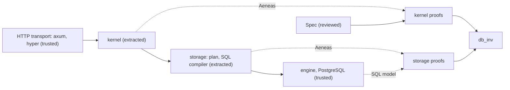

# h5i-app

The Axum-based application framework for [h5i](https://github.com/h5i-dev/h5i).
Write application logic in Rust and prove its properties in Lean 4.

[](https://crates.io/crates/h5i-app)

h5i-app was developed as [i5h](https://github.com/h5i-dev/i5h) and moved into
the h5i workspace, where it sits next to h5i's red-teaming tools: they test the
running application for what you did not anticipate, and h5i-app proves the
properties you can state. The i5h repository now hosts the benchmark.

```toml
[dependencies]
h5i-app = { version = "0.1", features = ["http", "postgres"] }
```

| Crate | Role |
|---|---|
| `h5i-app` | the entry point: re-exports the crates below behind features |
| `h5i-app-core` | the `Kernel` contract and an in-memory reference engine |
| `h5i-app-http` | axum integration: `Actor`, `H5iApp::respond`, `rpc_router` |
| `h5i-app-pg` | the PostgreSQL engine |
| `h5i-app-schema` | `schema!`: row types, table mappings, generated Lean |
| `h5i-app-sql` | write sets to keyed SQL statements (extracted, proven) |
| `h5i-app-pgsql` | statements to PostgreSQL text (extracted, proven) |
| `h5i-app-json` | the reply JSON writer (extracted, proven) |
| `h5i-app-token` | bearer-token encoding and parsing (extracted, proven) |

A kernel crate depends on `h5i-app-sql` and `h5i-app-schema` directly, so that
extraction sees only the code it translates.

## High level features

- Write the logic as pure Rust functions and prove it in Lean 4 via [Aeneas](https://github.com/AeneasVerif/aeneas).
- Serve it with [axum](https://github.com/tokio-rs/axum); handlers never touch the database.
- Run each request in a SERIALIZABLE PostgreSQL transaction, with retries and idempotency keys.
- Declare tables once with `schema!` and get Rust mappings and Lean proofs.
- Prove that invariants hold for the rows loaded back from the database.
- Prove properties across requests, for every order in which clients' requests commit.



## Usage example

The kernel is one function that decides what a command does. This one, from
the [calculator tutorial](../../examples/app/tutorials/calculator/TUTORIAL.md), keeps one number per user:

```rust
pub fn transition(actor: &Principal, snap: &Snapshot, cmd: &Command) -> Result<(Option<Memory>, Reply), Error> {
    match cmd {
        Command::Set { value } => Ok((Some(Memory { user: actor.user, value: *value }), Reply::Value(*value))),
        Command::Apply { op, arg } => {
            let m = memory_of(&snap.memories, actor.user);
            match compute(*op, m, *arg) {
                Ok(v) => Ok((Some(Memory { user: actor.user, value: v }), Reply::Value(v))),
                Err(e) => Err(e),
            }
        }
        Command::Get => Ok((None, Reply::Value(memory_of(&snap.memories, actor.user)))),
    }
}
```

The server around it is an ordinary axum application:

```rust
let engine = Arc::new(Engine::<Calc, CalcStore>::new(pool(&url, 8)?, EngineConfig::default()));
engine.install_schema().await?;
let app = H5iApp::new(engine, HmacAuth::<Calc>::new(secret, principal));
let router = Router::new().route("/healthz", get(|| async { "ok" })).merge(rpc_router(app));
axum::serve(TcpListener::bind("127.0.0.1:8080").await?, router).await?;
```

After the kernel is translated to Lean, you can prove properties of it, for
example that after any successful command a `get` by the same user returns its
result:

```lean
theorem get_after (a : Principal) (s s' : Snapshot) (c : Command) (w : Option Memory) (v : U64)
    (hroom : s.memories.length < Usize.max)
    (ht : transition a s c = ok (.Ok (w, .Value v))) (hs : apply s w = ok s') :
    transition a s' .Get = ok (.Ok (none, .Value v))
```

## License

This project is licensed under the [Apache-2.0 license](../../LICENSE).
