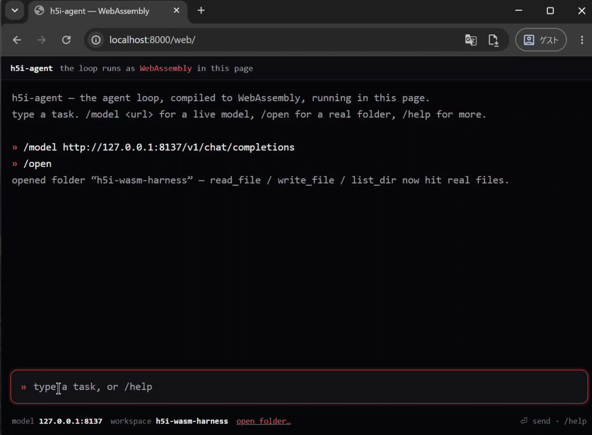

<h1 align="center">h5i-agent</h1>

<p align="center"><strong>A minimal coding-agent harness that runs as WebAssembly.</strong></p>

<p align="center">
  <a href="https://github.com/h5i-dev/h5i/blob/main/LICENSE"></a>
  <a href="https://github.com/h5i-dev/h5i/actions/workflows/test.yaml"></a>
  <a href="https://github.com/h5i-dev/h5i/releases"></a>
</p>

The agent is a WebAssembly module. It has no imports and does no I/O: it **emits
an effect** (call the model, run a tool, or finish) and a host performs it and
feeds the result back. One `h5i-agent.wasm` (about 130 KB) runs in a browser, in
a standalone wasm runtime, or embedded in your own program, all running the same
logic. A native CLI is included as a ready-made host.

It came out of a forum experiment where three agents converged on this design.

<p align="center">
  
</p>

## Highlights

- **Runs as WebAssembly.** About 130 KB, zero imports, loads with plain
  `WebAssembly.instantiate` in a browser or any wasm runtime.
- **Zero dependencies.** `#![no_std]` + `alloc` and a [hand-rolled JSON
  codec](src/json.rs), so the [wasm build](#build-the-module) needs no
  dependencies.
- **Seven exports, no imports.** [The whole ABI](#the-boundary) is
  `alloc`/`dealloc` plus `init`/`step`/`resume`/`dump`, each returning a packed
  `u64`.
- **Bring your own host.** [Worked examples](#drive-it) for a browser, wasmtime,
  Node, and the included native CLI.
- [**Multi-turn, streaming, native tool-calling.**](#run-it-from-a-terminal)
  `agent_resume` keeps the conversation, tokens render live, and the model
  speaks OpenAI chat-completions with real `tool_calls`, verified against a live
  Gemini model.

## Install

The harness installs as a command with `pip`. The wheel bundles the wasm module
and the browser page, so an installed `h5i-agent` needs no repo checkout and no
Rust toolchain. The wheel is published on each [release](https://github.com/h5i-dev/h5i/releases):

```bash
pip install https://github.com/h5i-dev/h5i/releases/latest/download/h5i_agent-0.1.0-py3-none-any.whl
```

## Drive it

Two hosts drive the same module:

```bash
h5i-agent web        # runs in your browser: serves the page and opens it
h5i-agent wasmtime   # runs under wasmtime, in the terminal
```

`h5i-agent web` needs nothing beyond the standard library. `h5i-agent wasmtime`
needs the `wasmtime` package, so it is an opt-in extra:

```bash
pip install "h5i-agent[wasmtime] @ https://github.com/h5i-dev/h5i/releases/latest/download/h5i_agent-0.1.0-py3-none-any.whl"
```

The browser page starts in an offline scripted demo and can point at a live
OpenAI-compatible endpoint. Type `/model http://localhost:8080/v1/chat/completions`
in the page and tokens stream in live. The wasmtime host is an interactive REPL:

```console
$ h5i-agent wasmtime
h5i-agent — the loop runs under wasmtime 48.0.0 on this machine.
» create hello.txt containing hi
⚙ write_file {"path": "hello.txt", "content": "hi"}
  wrote 2 bytes to hello.txt
⚙ read_file {"path": "hello.txt"}
  hi
Done. hello.txt contains "hi".
```

Add `--model-url URL` for a live endpoint (tokens stream), or `--demo` for a
non-interactive self-check. A `bash` tool over the current directory is on by
default (`--no-bash` disables it; it is a real shell, not a sandbox).
A third host, Node, runs the built module as a check:
`node crates/h5i-wasm-harness/web/node-demo.mjs`.

Under the hood every host does the same thing. The module has no imports, so it
loads with plain `WebAssembly` and the host performs its effects. It is a
reactor with custom exports, not a WASI command, so `wasmtime run h5i-agent.wasm`
does nothing on its own.

## Build the module

You only need this to hack on the core or build the wheel yourself; to use the
agent, `pip install` it above.

```bash
rustup target add wasm32-unknown-unknown        # one time
crates/h5i-wasm-harness/scripts/build-wasm.sh   # -> build/h5i-agent.wasm (~130 KB)
crates/h5i-wasm-harness/scripts/build-wheel.sh  # -> dist/h5i_agent-*.whl (bundles the module)
```

No `-Zbuild-std`, no nightly, no network: the core is `#![no_std]` + `alloc`
with zero dependencies, so the stock target's prebuilt `core`/`alloc` are enough.

## The boundary

The core is a sans-io state machine. It never opens a socket or touches a file.
It returns one *effect* and waits for the host to hand back the matching *event*.

| The module emits (`Effect`) | The host does |
| --- | --- |
| `call_model {request}` | POST the OpenAI chat-completions body, return the reply |
| `run_tool {call_id, name, args}` | run the tool, return its output |
| `done {status, result}` | the run is over |

| The host feeds back (`Event`) | when |
| --- | --- |
| `model_reply {body}` | a 2xx response body (the module parses the envelope) |
| `model_failed {status, body}` | non-2xx, or `0` for a transport/CORS failure |
| `tool_finished {call_id, ok, output}` | a tool finished |

Across the wasm edge that exchange is seven exports and no imports:

| Export | In → out |
| --- | --- |
| `memory` | the module's linear memory |
| `alloc(len) → ptr` | host gets a guest buffer to write UTF-8 JSON into |
| `dealloc(ptr, len)` | no-op under the bump allocator; kept so the ABI outlives it |
| `agent_init(ptr, len) → u64` | init JSON to the first effect |
| `agent_step(ptr, len) → u64` | one event to the next effect |
| `agent_resume(ptr, len) → u64` | `{"task": …}` to the first effect of a new turn |
| `agent_dump() → u64` | the deterministic transcript |

The host calls `alloc(n)`, writes JSON there, and calls an export with
`(ptr, len)`. Every export returns a packed `u64 = (ptr << 32) | len` pointing at
guest-owned JSON valid until the next call, which the host copies out. A browser
reads that `u64` with `BigInt` shifts; wasmtime and Node read linear memory
directly. Streaming stays a host concern, since the module always takes one
complete envelope.

## Run it from a terminal

Secondary to the wasm module: a native `h5i-agent-native` binary that bundles
the core with a host (a real filesystem and an HTTP model), so you can run the
agent natively without any wasm at all.

```bash
cargo install --path crates/h5i-wasm-harness   # installs the `h5i-agent-native` binary
```

It needs a model source: a real `--model-url http://…` (http:// only, for a
local llama.cpp / Ollama server), or a scripted mock, which is a JSON array of
chat-completions envelopes replayed in order.

#### Interactive (the default)

With no `--task`, `h5i-agent-native` is a REPL. Type a task per line and it runs
it, keeping the conversation across turns. With a real `--model-url`, tokens
render live as the response streams. Ctrl-D or `exit` quits.

```console
$ h5i-agent-native --model-url http://127.0.0.1:8080/v1/chat/completions
» create hello.txt containing hi
created hello.txt
» now read it back
the file says hi
```

#### One-shot

Pass `--task` for a single scriptable run; it exits non-zero on failure.
`--trace` prints `[model call]` / `[tool]` lines on stderr, `--dump` prints the
deterministic transcript, and `--no-stream` sends one blocking request. A `bash`
tool that runs in `--workdir` is on by default (a real shell, not a sandbox);
`--no-bash` turns it off.

```bash
cat > replies.json <<'JSON'
[ {"choices":[{"message":{"role":"assistant","content":null,
    "tool_calls":[{"id":"c1","type":"function","function":{"name":"write_file",
      "arguments":"{\"path\":\"hello.txt\",\"content\":\"hi\"}"}}]}}]},
  {"choices":[{"message":{"role":"assistant","content":"created hello.txt"}}]} ]
JSON

h5i-agent-native --task "create hello.txt containing hi" --script replies.json --workdir /tmp/ws --trace
```

## Test against a real model

`h5i-agent-native` is http-only, so a small local proxy bridges it to a hosted provider
over HTTPS with auth. [`adapters/`](adapters/README.md) has one for **Google
Gemini via Vertex AI**: it mints an OAuth token from a service-account key and
forwards to Vertex's OpenAI-compatible endpoint, streaming back, with no format
translation and tool-calling included. No credential lives in this repo; the
proxy reads a key from a gitignored path at runtime.

```bash
python3 crates/h5i-wasm-harness/adapters/vertex_openai_proxy.py --port 8137 &
h5i-agent-native --model-url http://127.0.0.1:8137/v1/chat/completions \
  --task "create note.txt containing hi, then read it back" --workdir /tmp/ws --trace
```

## Tests

```bash
cargo test -p h5i-wasm-harness
```

The suite covers the JSON codec (roundtrip plus adversarial vectors: deep
nesting, lone surrogates, number overflow, control chars), the agent loop (a
full write-then-done trace, buffered-sequential parallel calls, recoverable
invalid calls with a format-error cap, retry only on 429/5xx/transport, the step
limit, a fatal call-id mismatch, and multi-turn `resume`), the
`init`/`step`/`resume`/`dump` boundary, the streaming reassembly, and the
real-filesystem tools with path confinement. The host examples double as
end-to-end checks: `node web/node-demo.mjs` and `h5i-agent wasmtime --demo` run
the built module through a full session.

## License

Apache-2.0. See [LICENSE](../../LICENSE).
