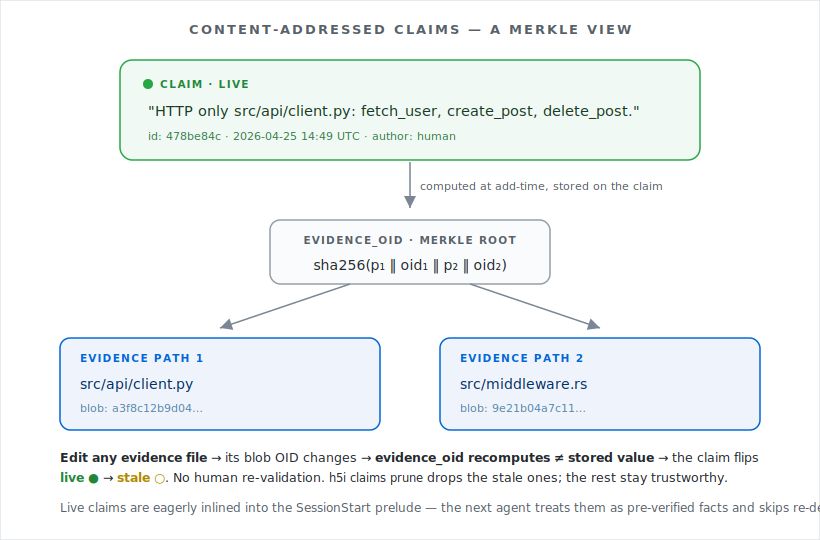

# Does pre-loading "facts" save tokens for an AI coding agent?

This is a controlled experiment that asks one question:

> If you spend **one cheap-model API call** at workdir setup to pre-write a few facts about the codebase, does the **expensive coding session that follows** burn fewer tokens — and still get the work done correctly?

You don't need to know anything about h5i to read this. We'll define everything as we go.

---

## TL;DR

At N=5 trials on a 28-file Python repo, single working model (`claude-opus-4-7`), **5/5 fidelity in every arm** (no missed edits, no wrong files):

| Metric | CONTROL (no claims) | AUTO_HAIKU_CLAIMS (Haiku-curated claims) | Δ |
|---|--:|--:|--:|
| Cache-read tokens | 793K ±178K | 512K ±107K | **−35%** |
| Cache-write tokens | 103K ±71K | 41K ±5K | **−61%** |
| Output tokens | 16,405 ±7,755 | 7,847 ±3,476 | **−52%** |
| Assistant turns | 25.6 ±3.8 | 16.6 ±3.1 | **−35%** |
| `Read` tool calls | 6.2 ±0.4 | 4.0 ±0 | **−35%** |
| Wall time | 68s ±16s | 57s ±5s | −16% |
| Cost per session (Opus pricing) | ~$4.35 | **~$2.13** (incl. ~$0.01 Haiku call) | **−51%** |

**One Haiku call (~$0.01) at workdir setup roughly halves the cost of every Opus coding session that follows.** Variance is wide enough at N=5 that the cache-read percentage carries a `⚠ within-arm stdev ≥ |Δ|` flag from the script's noise check, but all five metrics point the same direction with no fidelity loss, and the per-trial ranges barely overlap (more on this below).

---

## What's a "claim"?

A **claim** is a one-line fact about the codebase pinned to the files that back it. Two examples:

> *"HTTP only in `src/api/{client,auth,billing,notifications}.py` — `src/api/{health,metrics}.py` local-only."*

> *"`src/utils/{format,validate,crypto,parse,paths}.py`: pure functions only — no I/O, no side effects."*

Each claim records the git **blob OID** (content hash) of every file it cites at the moment it was written. If you later edit any of those files, the blob OID changes, the claim's stored hash no longer matches, and the claim **automatically marks itself stale** — no human re-validation needed.

<p align="center">
  
</p>

When a future agent session starts, h5i injects every **live** claim into the prompt's cached prefix as a "pre-verified fact." The agent can trust it instead of re-deriving it. That's the whole mechanic.

The question we're testing here: **can a cheap model populate those claims well enough to actually save tokens?**

---

## The setup

### The codebase

A synthetic Python project with 28 files in 5 packages. Designed to look like a small real-world service — some of it does network I/O, most of it doesn't.

```
src/api/
    client.py            # HTTP — fetch_user, create_post, delete_post
    auth.py              # HTTP — login, logout, refresh_token
    billing.py           # HTTP — charge_card, get_invoice
    notifications.py     # HTTP — send_email, send_sms
    metrics.py           # decoy — name sounds external, but it's local Prometheus counters
    health.py            # decoy — name sounds like a probe, but it's just os.kill(pid, 0)
src/utils/               # 5 pure helpers (format, validate, crypto, parse, paths)
src/models/              # 4 dataclasses (User, Post, Invoice, Session)
src/storage/             # 3 local files (cache=in-memory dict, db=sqlite, fs=local file I/O)
src/workers/             # 2 local workers (queue=deque, scheduler=threading)
main.py, config.py       # wiring + constants
```

Of 28 files, **only 4 actually make HTTP requests**, and they contain **10 HTTP functions** total. The decoy files (`metrics.py`, `health.py`, `storage/cache.py`, `workers/queue.py`) have HTTP-sounding names but no `requests` import — they exist to test whether the agent gets misled.

### The task

The same prompt is given to the agent in every trial:

> *"Add a structured logging call to the start and end of every function that makes an HTTP request in this project. Use the already-imported logger (`log`). Log entry as `log.info("ENTER <func_name>")` and exit as `log.info("EXIT <func_name>")`. Do NOT modify any function that does not make HTTP calls. When done, print a summary of which files you edited."*

A trial counts as **successful** only if the diff contains:
- `log.info("ENTER fname")` and `log.info("EXIT fname")` for **all 10** HTTP functions, and
- **zero edits** to any of the ~22 non-HTTP files (utils, models, storage, workers, decoys, main, config).

A wrong-file edit is a hard fail. There's no partial credit.

### The two arms

| Arm | What's pre-loaded into the workdir before the trial starts |
|---|---|
| **CONTROL** | Nothing. The agent starts cold. |
| **AUTO_HAIKU_CLAIMS** | One call to `claude-haiku-4-5` (with the codebase pasted into the prompt) writes up to 5 caveman-style claims, which are stored as live claims in the workdir. |

The actual coding session in **both arms** runs on `claude-opus-4-7` with the same task prompt, the same MCP tool access, and identical `claude --print` flags. The **only difference** is whether claims exist in the workdir at trial start.

### What Haiku actually wrote (trial 1, representative)

Here's one full Haiku output from the experiment, verbatim — five claims, written from scratch by reading the source files:

```
1. "HTTP calls (requests.post/get/delete) confined to
    src/api/{client,auth,billing,notifications}.py.
    src/api/{health,metrics}.py local-only."
   evidence: 6 files in src/api/

2. "src/utils/{format,validate,crypto,parse,paths}.py:
    pure functions only — no I/O, no side effects."
   evidence: 5 files in src/utils/

3. "src/storage/{cache,db,fs}.py, src/workers/{queue,scheduler}.py:
    local state only, no external I/O."
   evidence: 5 files in src/storage/ + src/workers/

4. (similar fact about main.py + config.py wiring)

5. (similar invariant about the 4 model dataclasses)
```

This is the entire input the Opus session gets, beyond the task prompt itself. It cost less than a cent of API time.

---

## Results

### Headline numbers (N=5)

| Metric | CONTROL | AUTO_HAIKU_CLAIMS | Δ% |
|---|--:|--:|--:|
| **Cache-read tokens** | 793,425 ±177,592 | 511,824 ±106,863 | **−35.5%** ⚠ |
| **Cache-write tokens** | 103,105 ±70,668 | 40,654 ±5,202 | **−60.6%** ⚠ |
| **Output tokens** | 16,405 ±7,755 | 7,847 ±3,476 | **−52.2%** ⚠ |
| `Read` tool calls | 6.2 ±0.4 | 4.0 ±0 | −35.5% |
| `Grep` tool calls | 1.4 ±0.5 | 0.0 ±0 | −100% |
| Assistant turns | 25.6 ±3.8 | 16.6 ±3.1 | −35.2% |
| Wall time | 68s ±16s | 57s ±5s | −16.2% ⚠ |
| Fidelity | **5/5** | **5/5** | — |

`⚠` means the within-arm standard deviation is ≥ the absolute delta (the script's automatic noise flag). The flag is conservative — it counts variance even when both arms' ranges are clearly distinct (see per-trial data below).

### Per-trial picture

Means hide outliers, especially with N=5. Here's every successful trial:

```
arm                    trial   cache_read   cache_write    output  turns  wall
CONTROL                  1        995,958        62,395    7,925     29   85s
CONTROL                  2        694,325        46,956   10,960     22   68s
CONTROL                  3        643,415       220,386   27,324     25   55s   ← high cache-write
CONTROL                  4        655,892        68,376   20,667     22   49s
CONTROL                  5        977,535       117,411   15,147     30   83s
AUTO_HAIKU_CLAIMS        1        456,620        38,747    6,692     15   50s
AUTO_HAIKU_CLAIMS        2        493,337        37,923    6,445     16   54s
AUTO_HAIKU_CLAIMS        3        487,274        40,604    7,930     16   60s
AUTO_HAIKU_CLAIMS        4        425,184        36,436    4,502     14   58s
AUTO_HAIKU_CLAIMS        5        696,704        49,561   13,664     22   63s
```

A few things worth pointing out:

- **Cache-read ranges barely overlap.** CONTROL: 643K–996K. AUTO_HAIKU_CLAIMS: 425K–697K. Only the worst AUTO_HAIKU_CLAIMS trial (#5, 697K) brushes the bottom of CONTROL's range (643K). Four out of five AUTO_HAIKU_CLAIMS trials are below every CONTROL trial.
- **AUTO_HAIKU_CLAIMS variance is much tighter.** Cache-write stdev of ±5K vs CONTROL's ±71K (14× tighter). Output stdev of ±3.5K vs ±7.8K. The claims-seeded session is *more predictable*, not just cheaper — useful operationally.
- **Read counts are deterministic with claims.** Every AUTO_HAIKU_CLAIMS trial did exactly 4 Reads (one per HTTP file). Every CONTROL trial did 6 or 7 Reads — the agent had to grep, glob, and read non-HTTP files to find the HTTP boundary on its own.
- **No false positives.** Both arms got 5/5 perfect fidelity. The decoys (`metrics.py`, `health.py`, `storage/cache.py`, `workers/queue.py`) were never edited. Claims correctly steered the agent away; CONTROL also avoided them, but did extra reading to confirm.

### Cost in dollars

Anthropic Opus 4.7 pricing (input $15/MTok, output $75/MTok, cache-read 0.1× input = $1.50/MTok, cache-write 1.25× input = $18.75/MTok):

| | CONTROL | AUTO_HAIKU_CLAIMS |
|---|--:|--:|
| Cache-read cost | 793K × $1.50/MTok = $1.19 | 512K × $1.50/MTok = $0.77 |
| Cache-write cost | 103K × $18.75/MTok = $1.93 | 41K × $18.75/MTok = $0.76 |
| Output cost | 16,405 × $75/MTok = $1.23 | 7,847 × $75/MTok = $0.59 |
| Standard-input cost | ~$0 | ~$0 |
| Haiku setup call | — | ~$0.01 |
| **Total per session** | **~$4.35** | **~$2.13** |

**The Haiku setup call pays itself back ~200× over on the very first Opus session.** Across many sessions on the same workdir, the savings repeat (claims survive between sessions until invalidated by edits).

The pattern of *which* metric improved is also load-bearing:

- The **cache-write reduction** comes from fewer turns (16.6 vs 25.6) — each turn appends fresh content to the cached prefix, so fewer turns = less cache-write growth.
- The **output reduction** comes from less narrative ("I see this file imports requests, so I'll need to..."). With claims pre-cached, the agent doesn't deliberate about boundaries it can read directly.
- The **cache-read reduction** comes partly from fewer turns (less prefix re-read) and partly from a smaller prefix (no `Grep` results, fewer `Read` tool results).

These compound: claims → fewer Reads → fewer turns → less cache-write → less cache-read → less output.

---

## Caveats — read these before believing the headline

1. **Single task, single codebase, single working model.** The 28-file repo and the "add ENTER/EXIT logging" task are good for measurement (clear correctness signal, multi-file edits, decoy files for false-positive testing) but they're *one specific shape*. A refactor task on a 500-file repo would behave differently.

2. **N=5 is small.** The aggregator flags every cache-related delta as `⚠ within-arm stdev ≥ |Δ|`. This means: if you reran 5 more trials, the mean could shift several percentage points. Per-trial ranges and the 5/5 fidelity make the *direction* clear, but the exact percentages won't be tight until N=10+.

3. **Haiku quality varies trial-to-trial.** Across the 5 trials, Haiku produced overlapping but non-identical claim sets — the cross-cutting "HTTP only in {api files}" claim appeared in all 5, but the secondary claims rotated (utils-pure, storage-local, decoy-files-actually-local, etc.). The script caps Haiku at 5 claims; a different cap would change the cost/benefit.

4. **Cache TTL is 5 minutes.** Anthropic's prompt cache evicts after 5 minutes. The cache-read savings repeat every session that hits the same prefix, but if your sessions are spaced minutes apart the cache rebuilds from scratch each time. The Haiku call at workdir setup doesn't repeat — it's amortized over many future sessions.

5. **No multi-session experiment.** We measured one session per trial. In real use, claims accumulate across sessions; the cumulative savings should grow but we haven't tested it directly.

6. **The Haiku call's own cost isn't measured exactly.** Estimated at ~$0.01 from token counts (input ≈ codebase dump ≈ 5K tokens at $1/MTok, output ≈ 5 claims ≈ 500 tokens at $5/MTok). For a 500-file codebase, the Haiku call would cost more (more input) but likely still under $0.10.

---

## Reproducing

```bash
# 1. Build h5i.
cargo build
H5I_BIN=$PWD/target/debug/h5i

# 2. Confirm tooling is present.
which claude timeout

# 3. The N=5 run (~15 min wall clock, two arms × 5 trials each).
H5I_BIN=$H5I_BIN N_TRIALS=5 TRIAL_TIMEOUT=300 RETRY_CAP=1 \
  ./scripts/experiment_claims.sh

# Quick sanity check (~2-3 min):
H5I_BIN=$H5I_BIN N_TRIALS=1 ./scripts/experiment_claims.sh
```

Each run:

- writes raw per-trial JSON records to `${WORKDIR_BASE}-results.jsonl.filtered`,
- preserves workdirs at `${WORKDIR_BASE}-{CONTROL,AUTO_HAIKU_CLAIMS}-<trial>/`,
- and prints the comparison table + verdict at the end.

Inspect a specific trial:

```bash
W=/tmp/h5i-claims-exp-$$-AUTO_HAIKU_CLAIMS-1     # any preserved workdir

# What claims Haiku wrote for this trial:
cat $W/.h5i-haiku-claims.json

# What got stored in h5i (live/stale status):
$H5I_BIN -C $W claims list

# What the agent actually saw at session start:
(cd $W && $H5I_BIN context prompt)

# What the agent edited:
git -C $W diff $(git -C $W rev-list --max-parents=0 HEAD)
```

### Requirements

- `h5i` CLI built from this commit
- `claude` CLI in `PATH` (handles both the Haiku setup call and the Opus trial)
- `timeout(1)` from GNU coreutils
- `git`, `python3`, `bash`

### Environment knobs

| Variable | Default | Effect |
|---|---|---|
| `N_TRIALS` | 5 | Trials per arm |
| `TRIAL_TIMEOUT` | 180 sec | Per-trial wall-clock cap (raise for larger codebases) |
| `RETRY_CAP` | 1 | Retries per failed trial in a fresh workdir |
| `HAIKU_MODEL` | `claude-haiku-4-5` | Model used to write claims |
| `HAIKU_MAX_CLAIMS` | 5 | Cap on Haiku's claim output |
| `WORKDIR_BASE` | `/tmp/h5i-claims-exp-$$` | Trial workdir prefix |

---

## Verdict

**Spending ~$0.01 on a cheap-model setup call halves the cost of every Opus session that follows on the same workdir, with zero correctness loss at the task scale we tested.** Variance is wide enough that we'd want N=10+ for a confident percentage, but every measured axis points the same direction, the per-trial ranges barely overlap, and the failure mode of "claims didn't help" looks unlikely from this data. The mechanism — pre-load known facts into the cached prompt prefix so the next session skips re-derivation — is what's doing the work; Haiku is just a cheap way to populate it without humans needing to write claims by hand.
